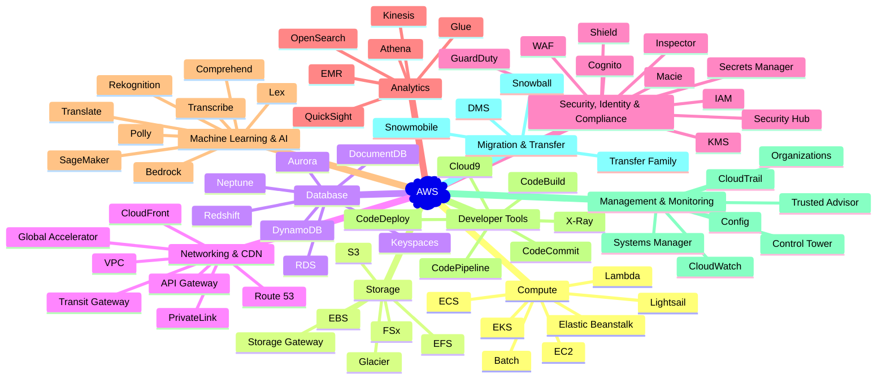

# Subhamay Bhattacharyya

<table border="0">
  <tr>
    <td>
      
    </td>
    <td>
      <h2>About Me</h2>
      <h3>Hi there 👋, I am Subhamay Bhattacharyya, 6x AWS, 1x Azure, 2x GitHub and 1x HashiCorp Terraform Certified and a AWS Cloud Enthusiast</h3>
    </td>
  </tr>
</table>

<table style="border-collapse: collapse; text-align: center;">
  <tr>
    <td>
      <table>
        <tr>
          <td></td>
          <td></td>
        </tr>
        <tr>
          <td></td>
          <td></td>
          <td></td>
          <td></td>
        </tr>
        <tr>
          <td></td>
          <td></td>
          <td></td>
        </tr>
      </table>
    </td>
    <td>
      <table>
        <tr>
          <td>
            
          </td>
        </tr>
        <tr>
          <td>
            

              <h3>GitHub Streak Stats</h3>
              

            

          </td>
        </tr>
      </table>
    </td>
  </tr>
</table>

  
<strong style="font-size: 1.5em;">Current Projects</strong>

  
| Repository          | Description             | URL                                         | Status         |
|:--------------------|:------------------------|:--------------------------------------------:|:---------------|
| terraform-template        | 📄🎯 GitHub Repository Template for Terraform as IaC.     |  | |
| github-repository-factory        | This repository is used to host Terraform config files to generate and maintain GitHub repositories     |  | |
| cloudformation-template        | 📄 🎯 GitHub Repository Template for CloudFormation as IaC.     |  | |
| github-repository-info-page        | Creates and updated the GitHub repository info page with the list of repositories and their progress. This repository will create the .github repository for the GitHub profile page.     |  | |
| cfn-release-wf        | GitHub Reusable Workflow: Release workflow for Cloudformation     |  | |

  
<strong style="font-size: 1.5em;">GitHub Action Projects</strong>

### GitHub Action Template Repository
| Repository          | Description         | URL                                         | Status         |
|:--------------------|:--------------------|:--------------------------------------------:|:---------------|
| github-action-template        | GitHub Composite Action: A Starter Template for GitHub Composite Action |  ||
### GitHub Reusable Action
| Repository          | Description         | URL                                         | Status         |
|:--------------------|:--------------------|:--------------------------------------------:|:---------------|
| .github        | Subhamay Bhattacharyya GitHub Actions and Workflows Organization |  ||
| branch-issue-action        | GitHub Composite Action - Check Branch Issue, to prevent pushing the code to any branch created directly using GitHub UI. |  ||
| build-glue-script-action        | GitHub Composite Action - Build Glue Script |  ||
| build-lambda-action        | GitHub Composite Action - Build Lambda Deployment Package |  ||
| build-lambda-layer-action        | GitHub Composite Action - Build Lambda Layer Deployment Package |  ||
| build-state-machine-action        | GitHub Composite Action - Build State Machine Deployment Package |  ||
| cfn-create-stack-action        | GitHub Composite Action - CloudFormation Create Stack |  ||
| cfn-delete-stack-action        | GitHub Composite Action - CloudFormation Delete Stack |  ||
| cfn-lint-action        | GitHub Composite Action - CloudFormation Linter |  ||
| cfn-parameters-action        | GitHub JavaScript Action - Prepare CloudFormation Stack Creation Parameters |  ||
| cfn-read-deployment-params-action        | GitHub Composite Action: Read CloudFormation deployment parameters from a JSON file |  ||
| cfn-stack-params-action        | GitHub JavaScript Action - Prepare CloudFormation Stack Creation Parameters |  ||
| cfn-validate-action        | GitHub Composite Action - CloudFormation Validate |  ||
| cfn-yor-action        | GitHub Composite Action - Add Git metadata tags to CloudFormation Template |  ||
| check-environments-action        | GitHub JavaScript Action - Check Available GitHub Environments |  ||
| checkov-report-action        | GitHub JavaScript Action - Print Checkov Scan Report |  ||
| checkov-scan-action        | GitHub Composite Action - Checkov Scan |  ||
| create-branch-action        | GitHub Composite Action - Auto Create Feature Branch |  ||
| create-release-action        | GitHub Composite Action - Create Draft Release with a clickable link to create the release. |  ||
| exec-path-action        | GitHub JavaScript Action: Determine the Execution Path of a CI pipeline. |  ||
| infracost-action        | GitHub Composite Action - Infra Cost |  ||
| list-updated-files-action        | GitHub Composite Action - List the files modified since the last commit. |  ||
| scan-aws-services-action        | GitHub JavaScript Action - Scan for the AWS Services (Lambda / Lambda Layer / Glue / State Machine) used in the repository. |  ||
| terraform-plugin-action        | GitHub Composite Action - Install and cache Terraform plugin |  ||
| tf-apply-action        | GitHub Composite Action - Terraform Apply. |  ||
| tf-destroy-action        | GitHub Composite Action - Terraform Destroy. |  ||
| tf-lint-action        | GitHub Composite Action - Terraform Lint. |  ||
| tf-plan-action        | GitHub Composite Action - Terraform Plan. |  ||
| tf-validate-action        | GitHub Composite Action - Terraform Format Check and Validation. |  ||
| tf-yor-action        | GitHub Composite Action - Add Git metadata tags . |  ||
| upload-s3-action        | GitHub JavaScript Action - Upload S3 Object |  ||
### GitHub Reusable Workflow
| Repository          | Description         | URL                                         | Status         |
|:--------------------|:--------------------|:--------------------------------------------:|:---------------|
| cfn-ci-reusable-wf        | GitHub Reusable Workflow: CI Pipeline using CloudFormation as IaC   |  ||
| cfn-release-wf        | GitHub Reusable Workflow: Release workflow for Cloudformation |  ||
| setup-aws-environments-wf        | GitHub Reusable Workflow to bootstrap AWS Environments |  ||
| slack-notification-wf        | GitHub Reusable Workflow : Send Slack Notification on opening an issue of pull request. |  ||
| terraform-apply-wf        | GitHub Reusable Workflow to create a stack using Terraform Apply |  ||
| terraform-destroy-wf        | GitHub Reusable Workflow to tear down a stack using Terraform Destroy |  ||
| tf-ci-reusable-wf        | GitHub Reusable Workflow: CI Pipeline using Terraform as IaC |  ||
| tf-drift-detection-wf        | GitHub Reusable Workflow to for Drift Detection of a Terraform Stack |  ||
| tf-modules-wf        | GitHub Reusable Workflow: Terraform Modules |  ||
| tf-pr-merge-and-release-wf        | GitHub Reusable Workflow to for Terraform Repository to Merge and Release a Pull Request  |  ||
| tf-release-wf        | GitHub Reusable Workflow: Terraform Release |  ||
| update-release-tags-wf        | GitHub Reusable Workflow to update release tags and branches |  ||

  
<strong style="font-size: 1.5em;">CloudFormation Projects</strong>

### API Gateway
| Repository          | Description             | URL                                         | Status         |
|:--------------------|:------------------------|:--------------------------------------------:|:---------------|
| 4301-api-gateway-cft        | Introduction to Amazon API Gateway using CloudFormation.     |  | |
| 4302-api-gateway-cft        | API Gateway REST Integrations using CloudFormation.     |  | |
| 4303-api-gateway-cft        | API Gateway REST Integrations Mock using CloudFormation.     |  | |
| 4304-api-gateway-cft        | API Gateway REST Integrations HTTP Integration using CloudFormation.     |  | |
| 4305-api-gateway-cft        | API Gateway REST Integrations AWS Lambda using CloudFormation.     |  | |
| 4306-api-gateway-cft        | API Gateway REST Integrations AWS Step Functions using CloudFormation.     |  | |
| 4307-api-gateway-cft        | API Gateway REST Integrations Amazon SQS using CloudFormation.     |  | |
| 4308-api-gateway-cft        | API Gateway REST Integrations Amazon SNS using CloudFormation.     |  | |
| 4309-api-gateway-cft        | API Gateway REST Integrations Amazon Kinesis using CloudFormation.     |  | |
| 4310-api-gateway-cft        | API Gateway REST Integrations Amazon DynamoDB using CloudFormation.     |  | |
| 4311-api-gateway-cft        | API Gateway REST Integrations Amazon EventBridge using CloudFormation.     |  | |
| 4312-api-gateway-cft        | API Gateway REST Integrations Private Integration using CloudFormation.     |  | |
| 4313-api-gateway-cft        | API Gateway REST Integrations Amazon S3 using CloudFormation.     |  | |
| 4314-api-gateway-cft        | Observability in API Gateway using CloudFormation.     |  | |
| 4315-api-gateway-cft        | WebSocket APIs using CloudFormation.     |  | |
| 4316-api-gateway-cft        | Enable fine-grained access control for your APIs using CloudFormation.     |  | |
### AWS Power Tools
| Repository          | Description             | URL                                         | Status         |
|:--------------------|:------------------------|:--------------------------------------------:|:---------------|
| 4201-power-tools-cft        | Workshop - Module 1 using CloudFormation.     |  | |
| 4202-power-tools-cft        | Workshop - Module 2 using CloudFormation.     |  | |
### Athena
| Repository          | Description             | URL                                         | Status         |
|:--------------------|:------------------------|:--------------------------------------------:|:---------------|
| 3801-athena-cft        | Athena Basics using CloudFormation.     |  | |
| 3802-athena-cft        | Athena Federation using CloudFormation.     |  | |
| 3803-athena-cft        | User Defined Functions using CloudFormation.     |  | |
| 3804-athena-cft        | Custom Data Source Connector using CloudFormation.     |  | |
| 3805-athena-cft        | Text Analysis using UDF using CloudFormation.     |  | |
| 3806-athena-cft        | Machine Learning using CloudFormation.     |  | |
| 3807-athena-cft        | ACID Transactions with Iceberg using CloudFormation.     |  | |
| 3808-athena-cft        | Athena Spark using CloudFormation.     |  | |
### Bedrock
| Repository          | Description             | URL                                         | Status         |
|:--------------------|:------------------------|:--------------------------------------------:|:---------------|
| 1101-bedrock-cft        | Text Generation with Amazon Bedrock using CloudFormation.     |  | |
| 1102-bedrock-cft        | Knowledge Bases and RAG using CloudFormation.     |  | |
| 1103-bedrock-cft        | Model Customization using CloudFormation.     |  | |
| 1104-bedrock-cft        | Image and Video Generation Applications using CloudFormation.     |  | |
| 1105-bedrock-cft        | Agents using CloudFormation.     |  | |
| 1701-bedrock-agent-cft        | Lab 1 - Create an Agent with Function Definition using CloudFormation.     |  | |
| 1702-bedrock-agent-cft        | Lab 2 - Create Agents with API Schema using CloudFormation.     |  | |
| 1703-bedrock-agent-cft        | Lab 3 - Create Agents with Return of Control (Function Calling) using CloudFormation.     |  | |
| 1704-bedrock-agent-cft        | Lab 4 - Create Agent with a Single Knowledge Base using CloudFormation.     |  | |
| 1705-bedrock-agent-cft        | Lab 5 - Create an Agent with a Knowledge Base and an Action Group using CloudFormation.     |  | |
| 1706-bedrock-agent-cft        | Lab 6 - Passing Prompt and Session Attributes to your Agent using CloudFormation.     |  | |
| 1707-bedrock-agent-cft        | Lab 7 - Overwriting Advanced Prompt and Custom Lambda Parsers using CloudFormation.     |  | |
| 1708-bedrock-agent-cft        | Lab 8 - Creating Agent with Guardrails for Amazon Bedrock integration using CloudFormation.     |  | |
| 1709-bedrock-agent-cft        | Lab 9 - Creating an agents with memory using CloudFormation.     |  | |
| 1710-bedrock-agent-cft        | Lab 10 - Creating an agent with code interpretation capabilities using CloudFormation.     |  | |
| 1711-bedrock-agent-cft        | Lab 11 - Creating Industry Specific Agents using CloudFormation.     |  | |
### Container
| Repository          | Description             | URL                                         | Status         |
|:--------------------|:------------------------|:--------------------------------------------:|:---------------|
| 1001-container-cft        | Lab 1. Containerize the Mythical Mysfits monolith using CloudFormation.     |  | |
| 1002-container-cft        | Lab 2. Deploy the container using AWS Fargate using CloudFormation.     |  | |
| 1003-container-cft        | Lab 3. Scale the adoption platform monolith with an ALB and an ECS Service using CloudFormation.     |  | |
| 1004-container-cft        | Lab 4. Incrementally build and deploy more microservices with AWS Fargate using CloudFormation.     |  | |
| 1005-container-cft        | Lab 5. Launch your Amazon EKS Cluster using CloudFormation.     |  | |
| 1006-container-cft        | Lab 6. Preparing EKS for the Mysfits using CloudFormation.     |  | |
| 1007-container-cft        | Lab 7. Deploying the monolith using CloudFormation.     |  | |
| 1008-container-cft        | Lab 8. Incrementally build and deploy more microservices with EKS and AWS Load Balancer Controller using CloudFormation.     |  | |
### Data Engineering
| Repository          | Description             | URL                                         | Status         |
|:--------------------|:------------------------|:--------------------------------------------:|:---------------|
| 5101-data-engineering-cft        | Lab: Real-Time Clickstream Anomaly Detection with Amazon Managed Service for Apache Flink using CloudFormation.     |  | |
| 5102-data-engineering-cft        | Lab: Ingestion with DMS using CloudFormation.     |  | |
| 5103-data-engineering-cft        | Lab: Transforming data with Glue using CloudFormation.     |  | |
| 5104-data-engineering-cft        | Lab: Query and Visualize using CloudFormation.     |  | |
| 5105-data-engineering-cft        | Lab: Data Lake Automation using CloudFormation.     |  | |
| 5106-data-engineering-cft        | Bonus Lab: Glue DataBrew using CloudFormation.     |  | |
### Data Lake
| Repository          | Description             | URL                                         | Status         |
|:--------------------|:------------------------|:--------------------------------------------:|:---------------|
| 0901-datalake-cft        | Lab 1 – Discovering and Cataloging your Data using CloudFormation.     |  | |
| 0902-datalake-cft        | Lab 2 - Exploring your Data using CloudFormation.     |  | |
| 0903-datalake-cft        | Lab 3 – Transforming your Data using CloudFormation.     |  | |
| 0904-datalake-cft        | Lab 4 – Enriching your Data using CloudFormation.     |  | |
| 0905-datalake-cft        | Lab 5 – Visualizing your Data using CloudFormation.     |  | |
| 4601-data-lake-cft        | Lab1: Data Ingestion & Storage using CloudFormation.     |  | |
| 4602-data-lake-cft        | Lab2: Data Cataloging and ETL using CloudFormation.     |  | |
| 4603-data-lake-cft        | Lab3: Data Analytics & Visualization using CloudFormation.     |  | |
### Data Protection
| Repository          | Description             | URL                                         | Status         |
|:--------------------|:------------------------|:--------------------------------------------:|:---------------|
| 0501-data-protection-cft        | Module 1: S3 Versioning using CloudFormation.     |  | |
| 0502-data-protection-cft        | Module 2: S3 Object Lock using CloudFormation.     |  | |
| 0503-data-protection-cft        | Module 3: S3 Replication using CloudFormation.     |  | |
| 0504-data-protection-cft        | Module 4: S3 Multi-Region Access Points using CloudFormation.     |  | |
| 0505-data-protection-cft        | Module 5: Cross-account S3 Replication and Multi-Region Access Points using CloudFormation.     |  | |
### Elastic Map Reduce
| Repository          | Description             | URL                                         | Status         |
|:--------------------|:------------------------|:--------------------------------------------:|:---------------|
| 2601-emr-cft        | Cluster Creation using CloudFormation.     |  | |
| 2602-emr-cft        | Spark-based ETL using CloudFormation.     |  | |
| 2603-emr-cft        | Hive Workshop using CloudFormation.     |  | |
| 2604-emr-cft        | Presto Workshop using CloudFormation.     |  | |
| 2605-emr-cft        | EMR Managed Scaling using CloudFormation.     |  | |
| 2606-emr-cft        | Pig Workshop using CloudFormation.     |  | |
| 2607-emr-cft        | EMR Notebooks and SageMaker using CloudFormation.     |  | |
| 2608-emr-cft        | Hudi Workshop using CloudFormation.     |  | |
| 2609-emr-cft        | Orchestrating Amazon EMR with AWS StepFunctions using CloudFormation.     |  | |
### Event Bridge
| Repository          | Description             | URL                                         | Status         |
|:--------------------|:------------------------|:--------------------------------------------:|:---------------|
| 1801-event-bridge-cft        | Event-driven with EventBridge using CloudFormation.     |  | |
| 1802-event-bridge-cft        | Event-driven with EventBridge using CloudFormation.     |  | |
| 1803-event-bridge-cft        | Using the schema registry using CloudFormation.     |  | |
| 1804-event-bridge-cft        | Archive and Replay using CloudFormation.     |  | |
| 1805-event-bridge-cft        | Global endpoints using CloudFormation.     |  | |
| 1806-event-bridge-cft        | Event-driven with Lambda using CloudFormation.     |  | |
| 1807-event-bridge-cft        | Event-driven with SNS using CloudFormation.     |  | |
### Foundation
| Repository          | Description             | URL                                         | Status         |
|:--------------------|:------------------------|:--------------------------------------------:|:---------------|
| 3101-foundation-cft        | AWS 101 Workshop - Creating a Web Application using CloudFormation.     |  | |
| 5001-disaster-recovery-cft        | Backup and Restore using CloudFormation.     |  | |
| 5002-disaster-recovery-cft        | Pilot Light using CloudFormation.     |  | |
| 5003-disaster-recovery-cft        | Warm Standby using CloudFormation.     |  | |
### General
| Repository          | Description             | URL                                         | Status         |
|:--------------------|:------------------------|:--------------------------------------------:|:---------------|
| 0401-general-cft        | Compute - Amazon EC2 using CloudFormation.     |  | |
| 0402-general-cft        | Network - Amazon VPC using CloudFormation.     |  | |
| 0403-general-cft        | Security - AWS IAM & Config & CloudTrail using CloudFormation.     |  | |
| 0404-general-cft        | Monitoring - Amazon CloudWatch using CloudFormation.     |  | |
| 0405-general-cft        | Database - Amazon RDS using CloudFormation.     |  | |
| 0406-general-cft        | Storage - Amazon S3 & EFS using CloudFormation.     |  | |
### Generative AI
| Repository          | Description             | URL                                         | Status         |
|:--------------------|:------------------------|:--------------------------------------------:|:---------------|
| 0801-gen-ai-cft        | Stream 1: Getting started with generative AI using CloudFormation.     |  | |
| 0802-gen-ai-cft        | Stream 2: Working with private documents using CloudFormation.     |  | |
| 0803-gen-ai-cft        | Stream 3: Working with image files using CloudFormation.     |  | |
| 0804-gen-ai-cft        | Stream 4: Working with video files using CloudFormation.     |  | |
| 0805-gen-ai-cft        | Stream 5: Working with audio files using CloudFormation.     |  | |
| 0806-gen-ai-cft        | Stream 6: Working with SQL database using CloudFormation.     |  | |
| 0807-gen-ai-cft        | Stream 7: Working with graphs using CloudFormation.     |  | |
| 0808-gen-ai-cft        | Stream 8: Working with business intelligence using CloudFormation.     |  | |
| 0809-gen-ai-cft        | Stream 9: Working with logs using CloudFormation.     |  | |
| 0810-gen-ai-cft        | Stream 10: Working with streaming data using CloudFormation.     |  | |
| 0811-gen-ai-cft        | Stream 11: Working with CSV files using CloudFormation.     |  | |
| 0812-gen-ai-cft        | Stream 12: Working with forms using CloudFormation.     |  | |
| 0813-gen-ai-cft        | Stream 13: Working with code using CloudFormation.     |  | |
| 2101-gen-ai-cft        | Building a Serverless Text-to-Speech Application with Amazon Polly using CloudFormation.     |  | |
| 2901-gen-ai-chatbot-cft        | Create a Serverless Chatbot Using Amazon Bedrock, Amazon Kendra, and Your Own Data using CloudFormation.     |  | |
| 3900-gen-ai-cft        | Module 1: Build an Agentic Chatbot using CloudFormation.     |  | |
| 3901-gen-ai-cft        | Module 2: Building an Agentic Workflow with Amazon Bedrock using CloudFormation.     |  | |
| 3902-gen-ai-cft        | Module 3: Using 3rd Party Agentic Workflows using CloudFormation.     |  | |
| 3903-gen-ai-cft        | Module 4: Building an Agentic Workflow with SageMaker AI using CloudFormation.     |  | |
| 4001-gen-ai-cft        | Data Discovery using CloudFormation.     |  | |
| 4002-gen-ai-cft        | Product and Support Knowledge Base using CloudFormation.     |  | |
| 4003-gen-ai-cft        | Customer AI Agent using CloudFormation.     |  | |
| 4004-gen-ai-cft        | Advanced QuickSight using CloudFormation.     |  | |
| 4101-gen-ai-llm-cft        | Configure event producer for current application using CloudFormation.     |  | |
| 4102-gen-ai-llm-cft        | Configure Amazon Bedrock Knowledge Base using CloudFormation.     |  | |
| 4103-gen-ai-llm-cft        | Deploy a new Chatbot feature in the existing application using CloudFormation.     |  | |
| 4104-gen-ai-llm-cft        | Optimize the Chat Function using CloudFormation.     |  | |
### GitHub Reusable Action
| Repository          | Description             | URL                                         | Status         |
|:--------------------|:------------------------|:--------------------------------------------:|:---------------|
| build-glue-script-action        | GitHub Composite Action - Build Glue Script     |  | |
| build-lambda-action        | GitHub Composite Action - Build Lambda Deployment Package     |  | |
| build-lambda-layer-action        | GitHub Composite Action - Build Lambda Layer Deployment Package     |  | |
| build-state-machine-action        | GitHub Composite Action - Build State Machine Deployment Package     |  | |
| cfn-create-stack-action        | GitHub Composite Action - CloudFormation Create Stack     |  | |
| cfn-delete-stack-action        | GitHub Composite Action - CloudFormation Delete Stack     |  | |
| cfn-lint-action        | GitHub Composite Action - CloudFormation Linter     |  | |
| cfn-read-deployment-params-action        | GitHub Composite Action: Read CloudFormation deployment parameters from a JSON file     |  | |
| cfn-stack-params-action        | GitHub JavaScript Action - Prepare CloudFormation Stack Creation Parameters     |  | |
| cfn-validate-action        | GitHub Composite Action - CloudFormation Validate     |  | |
| cfn-yor-action        | GitHub Composite Action - Add Git metadata tags to CloudFormation Template     |  | |
### GitHub Reusable Workflow
| Repository          | Description             | URL                                         | Status         |
|:--------------------|:------------------------|:--------------------------------------------:|:---------------|
| cfn-ci-reusable-wf        | GitHub Reusable Workflow: CI Pipeline using CloudFormation as IaC       |  | |
| cfn-release-wf        | GitHub Reusable Workflow: Release workflow for Cloudformation     |  | |
### Glue
| Repository          | Description             | URL                                         | Status         |
|:--------------------|:------------------------|:--------------------------------------------:|:---------------|
| 0201-glue-cft        | Lab 01: Working with Glue Data Catalog using CloudFormation.     |  | |
| 0202-glue-cft        | Lab 02: Working with Apache Spark using CloudFormation.     |  | |
| 0203-glue-cft        | Lab 03: Working with Glue ETL using CloudFormation.     |  | |
| 0204-glue-cft        | Lab 04: Working with Glue Streaming using CloudFormation.     |  | |
| 0205-glue-cft        | Lab 05: Working with Glue Studio using CloudFormation.     |  | |
| 0206-glue-cft        | Lab 06: Monitoring, Troubleshooting and Scaling using CloudFormation.     |  | |
| 0207-glue-cft        | Lab 07: Glue Job Orchestration using CloudFormation.     |  | |
| 0208-glue-cft        | Lab 08: CI/CD in AWS Glue using CloudFormation.     |  | |
| 0209-glue-cft        | Lab 09: Working with AWS Glue job bookmarks using CloudFormation.     |  | |
| 0210-glue-cft        | Lab 10: Working with AWS Glue Data Quality using CloudFormation.     |  | |
| 0211-glue-cft        | Lab 11: Working with Glue Databrew using CloudFormation.     |  | |
| 0212-glue-cft        | Legacy ETL to AWS Glue Migration using CloudFormation.     |  | |
| 2301-glue-cft        | Glue Crawler using CloudFormation.     |  | |
| 2302-glue-cft        | Glue Studio - ETL using CloudFormation.     |  | |
| 2303-glue-cft        | Lab 3: Personal Identifiable Information (PII) using CloudFormation.     |  | |
### Highly Available Architecture
| Repository          | Description             | URL                                         | Status         |
|:--------------------|:------------------------|:--------------------------------------------:|:---------------|
| 1401-highly-available-cft        | Highly Available Web Application Workshop using CloudFormation.     |  | |
### Kubernetes
| Repository          | Description             | URL                                         | Status         |
|:--------------------|:------------------------|:--------------------------------------------:|:---------------|
| 1201-kubernetes-cft        | Karpenter using CloudFormation.     |  | |
| 1202-kubernetes-cft        | Scaling an application and cluster using CloudFormation.     |  | |
### Migration
| Repository          | Description             | URL                                         | Status         |
|:--------------------|:------------------------|:--------------------------------------------:|:---------------|
| 3201-migration-cft        | Discover using CloudFormation.     |  | |
| 3202-migration-cft        | Database Migration using CloudFormation.     |  | |
| 3203-migration-cft        | Application Migration using CloudFormation.     |  | |
| 3204-migration-cft        | Elastic Disaster Recovery using CloudFormation.     |  | |
| 3501-migration-cft        | Module 1: The Monolith using CloudFormation.     |  | |
| 3502-migration-cft        | Module 2: Replatforming using Modernization Pathways using CloudFormation.     |  | |
| 3503-migration-cft        | Module 3: Move to Managed Database using CloudFormation.     |  | |
| 3504-migration-cft        | Module 4: Preparing to implement the Strangler Fig pattern using Amazon API Gateway using CloudFormation.     |  | |
| 3505-migration-cft        | Module 5: Microservices using CloudFormation.     |  | |
### Networking
| Repository          | Description             | URL                                         | Status         |
|:--------------------|:------------------------|:--------------------------------------------:|:---------------|
| 0301-vpc-cft        | VPC Fundamentals using CloudFormation.     |  | |
| 0302-vpc-cft        | Multiple VPCs using CloudFormation.     |  | |
| 0303-vpc-cft        | Security Controls using CloudFormation.     |  | |
| 0304-vpc-cft        | Connecting to On-Premises using CloudFormation.     |  | |
| 0305-vpc-cft        | Network Monitoring using CloudFormation.     |  | |
| 0306-vpc-cft        | AWS Gateway Load Balancer using CloudFormation.     |  | |
| 0307-vpc-cft        | Lab 1: Multicast in AWS using CloudFormation.     |  | |
| 0308-vpc-cft        | Lab #1 - VPC Components Deep Dive using CloudFormation.     |  | |
| 0309-vpc-cft        | Lab #2 - Transit Gateway and Site-to-Site VPNs using CloudFormation.     |  | |
| 0310-vpc-cft        | Lab #3 - Route53 DNS Endpoints and Internal Hosted Zones using CloudFormation.     |  | |
| 0311-vpc-cft        | Lab #4 - VPC Endpoints for AWS Services using CloudFormation.     |  | |
| 0312-vpc-cft        | Lab #5 - VPC Endpoint Services using CloudFormation.     |  | |
| 0313-vpc-cft        | Lab #6  VPC Peering using CloudFormation.     |  | |
| 0314-vpc-cft        | Lab #7 - Transit Gateway Network Manager using CloudFormation.     |  | |
| 1601-vpc-cft        | Module 1: Egress connectivity from an IPv6-only instance using CloudFormation.     |  | |
| 1602-vpc-cft        | Module 2: Ingress connectivity to IPv6-only instances using an NLB using CloudFormation.     |  | |
| 1603-vpc-cft        | Module 3: Private connectivity to IPv6 services using AWS PrivateLink using CloudFormation.     |  | |
| 1604-vpc-cft        | Module 4: IPv6 connectivity using AWS Transit Gateway using CloudFormation.     |  | |
| 1605-vpc-cft        | Module 5: Ingress connectivity to IPv6-only instances using ALB using CloudFormation.     |  | |
| 1606-vpc-cft        | Module 6: Understanding IPv6 on Amazon EKS using CloudFormation.     |  | |
### No Category
| Repository          | Description             | URL                                         | Status         |
|:--------------------|:------------------------|:--------------------------------------------:|:---------------|
| 0701-intelligence-dashboard-cft        | Cloud Intelligence Dashboards Framework using CloudFormation.     |  | |
| 1901-tagging-cft        | Managing tags using the console & AWS CLI using CloudFormation.     |  | |
| 1902-tagging-cft        | AWS Resource Groups using CloudFormation.     |  | |
| 1903-tagging-cft        | IaC & tagging using CloudFormation.     |  | |
| 1904-tagging-cft        | CI/CD & tagging using CloudFormation.     |  | |
| 1905-tagging-cft        | Tag Governance with AWS Config using CloudFormation.     |  | |
| 1906-tagging-cft        | AWS Tag Policies using CloudFormation.     |  | |
### Redshift
| Repository          | Description             | URL                                         | Status         |
|:--------------------|:------------------------|:--------------------------------------------:|:---------------|
| 2501-redshift-cft        | Getting Started using CloudFormation.     |  | |
| 2502-redshift-cft        | Table Design and Load using CloudFormation.     |  | |
| 2503-redshift-cft        | Ongoing Load - ELT using CloudFormation.     |  | |
| 2504-redshift-cft        | Data Sharing using CloudFormation.     |  | |
| 2505-redshift-cft        | Machine Learning - Redshift ML using CloudFormation.     |  | |
| 2506-redshift-cft        | Query Data Lake - Redshift Spectrum using CloudFormation.     |  | |
| 2507-redshift-cft        | Operations using CloudFormation.     |  | |
| 2508-redshift-cft        | Seamless Data Sharing Using Amazon Redshift using CloudFormation.     |  | |
### Sagemaker
| Repository          | Description             | URL                                         | Status         |
|:--------------------|:------------------------|:--------------------------------------------:|:---------------|
| 3601-sagemaker-cft        | Lakehouse using CloudFormation.     |  | |
| 3602-sagemaker-cft        | Catalog (Data & AI Governance) using CloudFormation.     |  | |
| 3603-sagemaker-cft        | Data Processing using CloudFormation.     |  | |
| 3604-sagemaker-cft        | SQL Analytics using CloudFormation.     |  | |
| 3605-sagemaker-cft        | ML/GenAI Model Development using CloudFormation.     |  | |
| 3606-sagemaker-cft        | Generative AI Application Development using CloudFormation.     |  | |
### Security Compliance
| Repository          | Description             | URL                                         | Status         |
|:--------------------|:------------------------|:--------------------------------------------:|:---------------|
| 2401-security-cft        | Infrastructure Protection using CloudFormation.     |  | |
| 2402-security-cft        | data-protection using CloudFormation.     |  | |
| 2403-security-cft        | Security Assurance using CloudFormation.     |  | |
| 2404-security-cft        | Identity and Access Management using CloudFormation.     |  | |
| 2801-security-compliance-cft        | Automating Incident Response Workshop using CloudFormation.     |  | |
### Serverless Patterns
| Repository          | Description             | URL                                         | Status         |
|:--------------------|:------------------------|:--------------------------------------------:|:---------------|
| 0601-serverless-cft        | M1 - Intro to Serverless using CloudFormation.     |  | |
| 0602-serverless-cft        | M2 - Synchronous Invocation using CloudFormation.     |  | |
| 0603-serverless-cft        | M3 - Synchronous + Idempotence using CloudFormation.     |  | |
| 0604-serverless-cft        | M4 - Asynchronous Invocation using CloudFormation.     |  | |
| 0605-serverless-cft        | M5 - Polling using CloudFormation.     |  | |
| 0606-serverless-cft        | M6 - Streaming Data using CloudFormation.     |  | |
| 0607-serverless-cft        | M7 - Streaming Datalake using CloudFormation.     |  | |
| 0608-serverless-cft        | M8 - Deployment Strategies using CloudFormation.     |  | |
| 5201-serverless-patterns-cft        | Simple CRUD API (HTTP → Lambda → DynamoDB) using CloudFormation.     |  | |
| 5202-serverless-patterns-cft        | Authenticated CRUD API (Cognito-authorized) using CloudFormation.     |  | |
| 5203-serverless-patterns-cft        | GraphQL API with Aurora Serverless using CloudFormation.     |  | |
| 5204-serverless-patterns-cft        | API Gateway → SQS (Async Ingestion) using CloudFormation.     |  | |
| 5205-serverless-patterns-cft        | S3 Event-Driven ETL using CloudFormation.     |  | |
| 5206-serverless-patterns-cft        | S3 → Step Functions (Fan-out & Orchestration) using CloudFormation.     |  | |
| 5207-serverless-patterns-cft        | Multipart Upload API using CloudFormation.     |  | |
| 5208-serverless-patterns-cft        | SNS Fan-out (Topic → Multiple Subscribers) using CloudFormation.     |  | |
| 5209-serverless-patterns-cft        | Queue Worker (SQS → Lambda) using CloudFormation.     |  | |
| 5210-serverless-patterns-cft        | Dead-Letter Handling Pipeline using CloudFormation.     |  | |
| 5211-serverless-patterns-cft        | Event Sourcing (DynamoDB Streams) using CloudFormation.     |  | |
| 5212-serverless-patterns-cft        | Saga Orchestration (Step Functions) using CloudFormation.     |  | |
| 5213-serverless-patterns-cft        | Human-in-the-loop Approval using CloudFormation.     |  | |
| 5214-serverless-patterns-cft        | Batch/Periodic Jobs using CloudFormation.     |  | |
| 5215-serverless-patterns-cft        | Web/Mobile Notifications using CloudFormation.     |  | |
| 5216-serverless-patterns-cft        | Email/Webhook Processor using CloudFormation.     |  | |
| 5217-serverless-patterns-cft        | Change Data Capture to Search using CloudFormation.     |  | |
| 5218-serverless-patterns-cft        | Read-Through Cache for Aurora using CloudFormation.     |  | |
| 5219-serverless-patterns-cft        | Data Lake Landing → Curated using CloudFormation.     |  | |
| 5220-serverless-patterns-cft        | Cognito User Management Hooks using CloudFormation.     |  | |
| 5221-serverless-patterns-cft        | Fine-Grained Authorization using CloudFormation.     |  | |
| 5222-serverless-patterns-cft        | Order Intake & Validation using CloudFormation.     |  | |
| 5223-serverless-patterns-cft        | Payment Orchestration using CloudFormation.     |  | |
| 5224-serverless-patterns-cft        | Receipt Generation & Storage using CloudFormation.     |  | |
| 5225-serverless-patterns-cft        | Media Transcode Pipeline using CloudFormation.     |  | |
| 5226-serverless-patterns-cft        | Lightweight Inference Endpoint using CloudFormation.     |  | |
| 5227-serverless-patterns-cft        | Idempotent Write-Behind using CloudFormation.     |  | |
| 5228-serverless-patterns-cft        | Outbox/Inbox Pattern using CloudFormation.     |  | |
| 5229-serverless-patterns-cft        | Dead-Simple Rate Limiting / Token Bucket using CloudFormation.     |  | |
| 5230-serverless-patterns-cft        | Blue/Green Read Model using CloudFormation.     |  | |
| 5231-serverless-patterns-cft        | Transaction-heavy Workflow using CloudFormation.     |  | |
| 5232-serverless-patterns-cft        | Hybrid NoSQL + SQL using CloudFormation.     |  | |
| 5233-serverless-patterns-cft        | Event Audit & Trace Correlation using CloudFormation.     |  | |
| 5234-serverless-patterns-cft        | Automated PII Redaction on Ingest using CloudFormation.     |  | |
### Step Function
| Repository          | Description             | URL                                         | Status         |
|:--------------------|:------------------------|:--------------------------------------------:|:---------------|
| 1301-step-function-cft        | First state machine using CloudFormation.     |  | |
| 1302-step-function-cft        | Integrating services using CloudFormation.     |  | |
| 1303-step-function-cft        | Handling errors using CloudFormation.     |  | |
| 1304-step-function-cft        | Versions and Aliases using CloudFormation.     |  | |
| 1305-step-function-cft        | Optimizing costs using CloudFormation.     |  | |
| 1306-step-function-cft        | Processing data in parallel using CloudFormation.     |  | |
| 1307-step-function-cft        | Processing arrays of data using CloudFormation.     |  | |
| 1308-step-function-cft        | Creating state machines with IaC using CloudFormation.     |  | |
| 1309-step-function-cft        | Integrate with Amazon ECS using CloudFormation.     |  | |
| 1310-step-function-cft        | Distributed map using CloudFormation.     |  | |
| 1311-step-function-cft        | Human approval using CloudFormation.     |  | |
| 1312-step-function-cft        | Wait for external system using CloudFormation.     |  | |
| 1313-step-function-cft        | External HTTP integration using CloudFormation.     |  | |
| 1314-step-function-cft        | Integrate with Amazon Bedrock using CloudFormation.     |  | |
| 1315-step-function-cft        | Saga Pattern using CloudFormation.     |  | |
| 1316-step-function-cft        | Product feedback processing using CloudFormation.     |  | |
| 1317-step-function-cft        | Language Detection and Translation using CloudFormation.     |  | |
| 1318-step-function-cft        | Text Summarization using CloudFormation.     |  | |
### Storage
| Repository          | Description             | URL                                         | Status         |
|:--------------------|:------------------------|:--------------------------------------------:|:---------------|
| 0101-storage-cft        | S3 Security Best Practices using CloudFormation.     |  | |
| 0102-storage-cft        | Storage Performance Lab using CloudFormation.     |  | |
| 0103-storage-cft        | Migrating Data to AWS using CloudFormation.     |  | |
| 0104-storage-cft        | AWS Backup Lab using CloudFormation.     |  | |
### TemplateRepository
| Repository          | Description             | URL                                         | Status         |
|:--------------------|:------------------------|:--------------------------------------------:|:---------------|
| cloudformation-template        | 📄 🎯 GitHub Repository Template for CloudFormation as IaC.     |  | |

  
<strong style="font-size: 1.5em;">Terraform Projects</strong>

### API Gateway
| Repository          | Description             | URL                                         | Status         |
|:--------------------|:------------------------|:--------------------------------------------:|:---------------|
| 4301-api-gateway-tf        | Introduction to Amazon API Gateway using Terraform.     |  | |
| 4302-api-gateway-tf        | API Gateway REST Integrations using Terraform.     |  | |
| 4303-api-gateway-tf        | API Gateway REST Integrations Mock using Terraform.     |  | |
| 4304-api-gateway-tf        | API Gateway REST Integrations HTTP Integration using Terraform.     |  | |
| 4305-api-gateway-tf        | API Gateway REST Integrations AWS Lambda using Terraform.     |  | |
| 4306-api-gateway-tf        | API Gateway REST Integrations AWS Step Functions using Terraform.     |  | |
| 4307-api-gateway-tf        | API Gateway REST Integrations Amazon SQS using Terraform.     |  | |
| 4308-api-gateway-tf        | API Gateway REST Integrations Amazon SNS using Terraform.     |  | |
| 4309-api-gateway-tf        | API Gateway REST Integrations Amazon Kinesis using Terraform.     |  | |
| 4310-api-gateway-tf        | API Gateway REST Integrations Amazon DynamoDB using Terraform.     |  | |
| 4311-api-gateway-tf        | API Gateway REST Integrations Amazon EventBridge using Terraform.     |  | |
| 4312-api-gateway-tf        | API Gateway REST Integrations Private Integration using Terraform.     |  | |
| 4313-api-gateway-tf        | API Gateway REST Integrations Amazon S3 using Terraform.     |  | |
| 4314-api-gateway-tf        | Observability in API Gateway using Terraform.     |  | |
| 4315-api-gateway-tf        | WebSocket APIs using Terraform.     |  | |
| 4316-api-gateway-tf        | Enable fine-grained access control for your APIs using Terraform.     |  | |
### AWS Power Tools
| Repository          | Description             | URL                                         | Status         |
|:--------------------|:------------------------|:--------------------------------------------:|:---------------|
| 4201-power-tools-tf        | Workshop - Module 1 using Terraform.     |  | |
| 4202-power-tools-tf        | Workshop - Module 2 using Terraform.     |  | |
### Athena
| Repository          | Description             | URL                                         | Status         |
|:--------------------|:------------------------|:--------------------------------------------:|:---------------|
| 3801-athena-tf        | Athena Basics using Terraform.     |  | |
| 3802-athena-tf        | Athena Federation using Terraform.     |  | |
| 3803-athena-tf        | User Defined Functions using Terraform.     |  | |
| 3804-athena-tf        | Custom Data Source Connector using Terraform.     |  | |
| 3805-athena-tf        | Text Analysis using UDF using Terraform.     |  | |
| 3806-athena-tf        | Machine Learning using Terraform.     |  | |
| 3807-athena-tf        | ACID Transactions with Iceberg using Terraform.     |  | |
| 3808-athena-tf        | Athena Spark using Terraform.     |  | |
### Bedrock
| Repository          | Description             | URL                                         | Status         |
|:--------------------|:------------------------|:--------------------------------------------:|:---------------|
| 1101-bedrock-tf        | Text Generation with Amazon Bedrock using Terraform.     |  | |
| 1102-bedrock-tf        | Knowledge Bases and RAG using Terraform.     |  | |
| 1103-bedrock-tf        | Model Customization using Terraform.     |  | |
| 1104-bedrock-tf        | Image and Video Generation Applications using Terraform.     |  | |
| 1105-bedrock-tf        | Agents using Terraform.     |  | |
| 1701-bedrock-agent-tf        | Lab 1 - Create an Agent with Function Definition using Terraform.     |  | |
| 1702-bedrock-agent-tf        | Lab 2 - Create Agents with API Schema using Terraform.     |  | |
| 1703-bedrock-agent-tf        | Lab 3 - Create Agents with Return of Control (Function Calling) using Terraform.     |  | |
| 1704-bedrock-agent-tf        | Lab 4 - Create Agent with a Single Knowledge Base using Terraform.     |  | |
| 1705-bedrock-agent-tf        | Lab 5 - Create an Agent with a Knowledge Base and an Action Group using Terraform.     |  | |
| 1706-bedrock-agent-tf        | Lab 6 - Passing Prompt and Session Attributes to your Agent using Terraform.     |  | |
| 1707-bedrock-agent-tf        | Lab 7 - Overwriting Advanced Prompt and Custom Lambda Parsers using Terraform.     |  | |
| 1708-bedrock-agent-tf        | Lab 8 - Creating Agent with Guardrails for Amazon Bedrock integration using Terraform.     |  | |
| 1709-bedrock-agent-tf        | Lab 9 - Creating an agents with memory using Terraform.     |  | |
| 1710-bedrock-agent-tf        | Lab 10 - Creating an agent with code interpretation capabilities using Terraform.     |  | |
| 1711-bedrock-agent-tf        | Lab 11 - Creating Industry Specific Agents using Terraform.     |  | |
### Container
| Repository          | Description             | URL                                         | Status         |
|:--------------------|:------------------------|:--------------------------------------------:|:---------------|
| 1001-container-tf        | Lab 1. Containerize the Mythical Mysfits monolith using Terraform.     |  | |
| 1002-container-tf        | Lab 2. Deploy the container using AWS Fargate using Terraform.     |  | |
| 1003-container-tf        | Lab 3. Scale the adoption platform monolith with an ALB and an ECS Service using Terraform.     |  | |
| 1004-container-tf        | Lab 4. Incrementally build and deploy more microservices with AWS Fargate using Terraform.     |  | |
| 1005-container-tf        | Lab 5. Launch your Amazon EKS Cluster using Terraform.     |  | |
| 1006-container-tf        | Lab 6. Preparing EKS for the Mysfits using Terraform.     |  | |
| 1007-container-tf        | Lab 7. Deploying the monolith using Terraform.     |  | |
| 1008-container-tf        | Lab 8. Incrementally build and deploy more microservices with EKS and AWS Load Balancer Controller using Terraform.     |  | |
### Data Engineering
| Repository          | Description             | URL                                         | Status         |
|:--------------------|:------------------------|:--------------------------------------------:|:---------------|
| 5101-data-engineering-tf        | Lab: Real-Time Clickstream Anomaly Detection with Amazon Managed Service for Apache Flink using Terraform.     |  | |
| 5102-data-engineering-tf        | Lab: Ingestion with DMS using Terraform.     |  | |
| 5103-data-engineering-tf        | Lab: Transforming data with Glue using Terraform.     |  | |
| 5104-data-engineering-tf        | Lab: Query and Visualize using Terraform.     |  | |
| 5105-data-engineering-tf        | Lab: Data Lake Automation using Terraform.     |  | |
| 5106-data-engineering-tf        | Bonus Lab: Glue DataBrew using Terraform.     |  | |
### Data Lake
| Repository          | Description             | URL                                         | Status         |
|:--------------------|:------------------------|:--------------------------------------------:|:---------------|
| 0901-datalake-tf        | Lab 1 – Discovering and Cataloging your Data using Terraform.     |  | |
| 0902-datalake-tf        | Lab 2 - Exploring your Data using Terraform.     |  | |
| 0903-datalake-tf        | Lab 3 – Transforming your Data using Terraform.     |  | |
| 0904-datalake-tf        | Lab 4 – Enriching your Data using Terraform.     |  | |
| 0905-datalake-tf        | Lab 5 – Visualizing your Data using Terraform.     |  | |
| 4601-data-lake-tf        | Lab1: Data Ingestion & Storage using Terraform.     |  | |
| 4602-data-lake-tf        | Lab2: Data Cataloging and ETL using Terraform.     |  | |
| 4603-data-lake-tf        | Lab3: Data Analytics & Visualization using Terraform.     |  | |
### Data Protection
| Repository          | Description             | URL                                         | Status         |
|:--------------------|:------------------------|:--------------------------------------------:|:---------------|
| 0501-data-protection-tf        | Module 1: S3 Versioning using Terraform.     |  | |
| 0502-data-protection-tf        | Module 2: S3 Object Lock using Terraform.     |  | |
| 0503-data-protection-tf        | Module 3: S3 Replication using Terraform.     |  | |
| 0504-data-protection-tf        | Module 4: S3 Multi-Region Access Points using Terraform.     |  | |
| 0505-data-protection-tf        | Module 5: Cross-account S3 Replication and Multi-Region Access Points using Terraform.     |  | |
### Elastic Map Reduce
| Repository          | Description             | URL                                         | Status         |
|:--------------------|:------------------------|:--------------------------------------------:|:---------------|
| 2601-emr-tf        | Cluster Creation using Terraform.     |  | |
| 2602-emr-tf        | Spark-based ETL using Terraform.     |  | |
| 2603-emr-tf        | Hive Workshop using Terraform.     |  | |
| 2604-emr-tf        | Presto Workshop using Terraform.     |  | |
| 2605-emr-tf        | EMR Managed Scaling using Terraform.     |  | |
| 2606-emr-tf        | Pig Workshop using Terraform.     |  | |
| 2607-emr-tf        | EMR Notebooks and SageMaker using Terraform.     |  | |
| 2608-emr-tf        | Hudi Workshop using Terraform.     |  | |
| 2609-emr-tf        | Orchestrating Amazon EMR with AWS StepFunctions using Terraform.     |  | |
### Event Bridge
| Repository          | Description             | URL                                         | Status         |
|:--------------------|:------------------------|:--------------------------------------------:|:---------------|
| 1801-event-bridge-tf        | Event-driven with EventBridge using Terraform.     |  | |
| 1802-event-bridge-tf        | Event-driven with EventBridge using Terraform.     |  | |
| 1803-event-bridge-tf        | Using the schema registry using Terraform.     |  | |
| 1804-event-bridge-tf        | Archive and Replay using Terraform.     |  | |
| 1805-event-bridge-tf        | Global endpoints using Terraform.     |  | |
| 1806-event-bridge-tf        | Event-driven with Lambda using Terraform.     |  | |
| 1807-event-bridge-tf        | Event-driven with SNS using Terraform.     |  | |
### Foundation
| Repository          | Description             | URL                                         | Status         |
|:--------------------|:------------------------|:--------------------------------------------:|:---------------|
| 3101-foundation-tf        | AWS 101 Workshop - Creating a Web Application using Terraform.     |  | |
| 5001-disaster-recovery-tf        | Backup and Restore using Terraform.     |  | |
| 5002-disaster-recovery-tf        | Pilot Light using Terraform.     |  | |
| 5003-disaster-recovery-tf        | Warm Standby using Terraform.     |  | |
### General
| Repository          | Description             | URL                                         | Status         |
|:--------------------|:------------------------|:--------------------------------------------:|:---------------|
| 0401-general-tf        | Compute - Amazon EC2 using Terraform.     |  | |
| 0402-general-tf        | Network - Amazon VPC using Terraform.     |  | |
| 0403-general-tf        | Security - AWS IAM & Config & CloudTrail using Terraform.     |  | |
| 0404-general-tf        | Monitoring - Amazon CloudWatch using Terraform.     |  | |
| 0405-general-tf        | Database - Amazon RDS using Terraform.     |  | |
| 0406-general-tf        | Storage - Amazon S3 & EFS using Terraform.     |  | |
### Generative AI
| Repository          | Description             | URL                                         | Status         |
|:--------------------|:------------------------|:--------------------------------------------:|:---------------|
| 0801-gen-ai-tf        | Stream 1: Getting started with generative AI using Terraform.     |  | |
| 0802-gen-ai-tf        | Stream 2: Working with private documents using Terraform.     |  | |
| 0803-gen-ai-tf        | Stream 3: Working with image files using Terraform.     |  | |
| 0804-gen-ai-tf        | Stream 4: Working with video files using Terraform.     |  | |
| 0805-gen-ai-tf        | Stream 5: Working with audio files using Terraform.     |  | |
| 0806-gen-ai-tf        | Stream 6: Working with SQL database using Terraform.     |  | |
| 0807-gen-ai-tf        | Stream 7: Working with graphs using Terraform.     |  | |
| 0808-gen-ai-tf        | Stream 8: Working with business intelligence using Terraform.     |  | |
| 0809-gen-ai-tf        | Stream 9: Working with logs using Terraform.     |  | |
| 0810-gen-ai-tf        | Stream 10: Working with streaming data using Terraform.     |  | |
| 0811-gen-ai-tf        | Stream 11: Working with CSV files using Terraform.     |  | |
| 0812-gen-ai-tf        | Stream 12: Working with forms using Terraform.     |  | |
| 0813-gen-ai-tf        | Stream 13: Working with code using Terraform.     |  | |
| 2101-gen-ai-tf        | Building a Serverless Text-to-Speech Application with Amazon Polly using Terraform.     |  | |
| 2901-gen-ai-chatbot-tf        | Create a Serverless Chatbot Using Amazon Bedrock, Amazon Kendra, and Your Own Data using Terraform.     |  | |
| 3900-gen-ai-tf        | Module 1: Build an Agentic Chatbot using Terraform.     |  | |
| 3901-gen-ai-tf        | Module 2: Building an Agentic Workflow with Amazon Bedrock using Terraform.     |  | |
| 3902-gen-ai-tf        | Module 3: Using 3rd Party Agentic Workflows using Terraform.     |  | |
| 3903-gen-ai-tf        | Module 4: Building an Agentic Workflow with SageMaker AI using Terraform.     |  | |
| 4001-gen-ai-tf        | Data Discovery using Terraform.     |  | |
| 4002-gen-ai-tf        | Product and Support Knowledge Base using Terraform.     |  | |
| 4003-gen-ai-tf        | Customer AI Agent using Terraform.     |  | |
| 4004-gen-ai-tf        | Advanced QuickSight using Terraform.     |  | |
| 4101-gen-ai-llm-tf        | Configure event producer for current application using Terraform.     |  | |
| 4102-gen-ai-llm-tf        | Configure Amazon Bedrock Knowledge Base using Terraform.     |  | |
| 4103-gen-ai-llm-tf        | Deploy a new Chatbot feature in the existing application using Terraform.     |  | |
| 4104-gen-ai-llm-tf        | Optimize the Chat Function using Terraform.     |  | |
### Glue
| Repository          | Description             | URL                                         | Status         |
|:--------------------|:------------------------|:--------------------------------------------:|:---------------|
| 0201-glue-tf        | Lab 01: Working with Glue Data Catalog using Terraform.     |  | |
| 0202-glue-tf        | Lab 02: Working with Apache Spark using Terraform.     |  | |
| 0203-glue-tf        | Lab 03: Working with Glue ETL using Terraform.     |  | |
| 0204-glue-tf        | Lab 04: Working with Glue Streaming using Terraform.     |  | |
| 0205-glue-tf        | Lab 05: Working with Glue Studio using Terraform.     |  | |
| 0206-glue-tf        | Lab 06: Monitoring, Troubleshooting and Scaling using Terraform.     |  | |
| 0207-glue-tf        | Lab 07: Glue Job Orchestration using Terraform.     |  | |
| 0208-glue-tf        | Lab 08: CI/CD in AWS Glue using Terraform.     |  | |
| 0209-glue-tf        | Lab 09: Working with AWS Glue job bookmarks using Terraform.     |  | |
| 0210-glue-tf        | Lab 10: Working with AWS Glue Data Quality using Terraform.     |  | |
| 0211-glue-tf        | Lab 11: Working with Glue Databrew using Terraform.     |  | |
| 0212-glue-tf        | Legacy ETL to AWS Glue Migration using Terraform.     |  | |
| 2301-glue-tf        | Glue Crawler using Terraform.     |  | |
| 2302-glue-tf        | Glue Studio - ETL using Terraform.     |  | |
| 2303-glue-tf        | Lab 3: Personal Identifiable Information (PII) using Terraform.     |  | |
### Highly Available Architecture
| Repository          | Description             | URL                                         | Status         |
|:--------------------|:------------------------|:--------------------------------------------:|:---------------|
| 1401-highly-available-tf        | Highly Available Web Application Workshop using Terraform.     |  | |
### Kubernetes
| Repository          | Description             | URL                                         | Status         |
|:--------------------|:------------------------|:--------------------------------------------:|:---------------|
| 1201-kubernetes-tf        | Karpenter using Terraform.     |  | |
| 1202-kubernetes-tf        | Scaling an application and cluster using Terraform.     |  | |
### Migration
| Repository          | Description             | URL                                         | Status         |
|:--------------------|:------------------------|:--------------------------------------------:|:---------------|
| 3201-migration-tf        | Discover using Terraform.     |  | |
| 3202-migration-tf        | Database Migration using Terraform.     |  | |
| 3203-migration-tf        | Application Migration using Terraform.     |  | |
| 3204-migration-tf        | Elastic Disaster Recovery using Terraform.     |  | |
| 3501-migration-tf        | Module 1: The Monolith using Terraform.     |  | |
| 3502-migration-tf        | Module 2: Replatforming using Modernization Pathways using Terraform.     |  | |
| 3503-migration-tf        | Module 3: Move to Managed Database using Terraform.     |  | |
| 3504-migration-tf        | Module 4: Preparing to implement the Strangler Fig pattern using Amazon API Gateway using Terraform.     |  | |
| 3505-migration-tf        | Module 5: Microservices using Terraform.     |  | |
### Networking
| Repository          | Description             | URL                                         | Status         |
|:--------------------|:------------------------|:--------------------------------------------:|:---------------|
| 0301-vpc-tf        | VPC Fundamentals using Terraform.     |  | |
| 0302-vpc-tf        | Multiple VPCs using Terraform.     |  | |
| 0303-vpc-tf        | Security Controls using Terraform.     |  | |
| 0304-vpc-tf        | Connecting to On-Premises using Terraform.     |  | |
| 0305-vpc-tf        | Network Monitoring using Terraform.     |  | |
| 0306-vpc-tf        | AWS Gateway Load Balancer using Terraform.     |  | |
| 0307-vpc-tf        | Lab 1: Multicast in AWS using Terraform.     |  | |
| 0308-vpc-tf        | Lab #1 - VPC Components Deep Dive using Terraform.     |  | |
| 0309-vpc-tf        | Lab #2 - Transit Gateway and Site-to-Site VPNs using Terraform.     |  | |
| 0310-vpc-tf        | Lab #3 - Route53 DNS Endpoints and Internal Hosted Zones using Terraform.     |  | |
| 0311-vpc-tf        | Lab #4 - VPC Endpoints for AWS Services using Terraform.     |  | |
| 0312-vpc-tf        | Lab #5 - VPC Endpoint Services using Terraform.     |  | |
| 0313-vpc-tf        | Lab #6  VPC Peering using Terraform.     |  | |
| 0314-vpc-tf        | Lab #7 - Transit Gateway Network Manager using Terraform.     |  | |
| 1601-vpc-tf        | Module 1: Egress connectivity from an IPv6-only instance using Terraform.     |  | |
| 1602-vpc-tf        | Module 2: Ingress connectivity to IPv6-only instances using an NLB using Terraform.     |  | |
| 1603-vpc-tf        | Module 3: Private connectivity to IPv6 services using AWS PrivateLink using Terraform.     |  | |
| 1604-vpc-tf        | Module 4: IPv6 connectivity using AWS Transit Gateway using Terraform.     |  | |
| 1605-vpc-tf        | Module 5: Ingress connectivity to IPv6-only instances using ALB using Terraform.     |  | |
| 1606-vpc-tf        | Module 6: Understanding IPv6 on Amazon EKS using Terraform.     |  | |
### No Category
| Repository          | Description             | URL                                         | Status         |
|:--------------------|:------------------------|:--------------------------------------------:|:---------------|
| 0701-intelligence-dashboard-tf        | Cloud Intelligence Dashboards Framework using Terraform.     |  | |
| 1901-tagging-tf        | Managing tags using the console & AWS CLI using Terraform.     |  | |
| 1902-tagging-tf        | AWS Resource Groups using Terraform.     |  | |
| 1903-tagging-tf        | IaC & tagging using Terraform.     |  | |
| 1904-tagging-tf        | CI/CD & tagging using Terraform.     |  | |
| 1905-tagging-tf        | Tag Governance with AWS Config using Terraform.     |  | |
| 1906-tagging-tf        | AWS Tag Policies using Terraform.     |  | |
### Redshift
| Repository          | Description             | URL                                         | Status         |
|:--------------------|:------------------------|:--------------------------------------------:|:---------------|
| 2501-redshift-tf        | Getting Started using Terraform.     |  | |
| 2502-redshift-tf        | Table Design and Load using Terraform.     |  | |
| 2503-redshift-tf        | Ongoing Load - ELT using Terraform.     |  | |
| 2504-redshift-tf        | Data Sharing using Terraform.     |  | |
| 2505-redshift-tf        | Machine Learning - Redshift ML using Terraform.     |  | |
| 2506-redshift-tf        | Query Data Lake - Redshift Spectrum using Terraform.     |  | |
| 2507-redshift-tf        | Operations using Terraform.     |  | |
| 2508-redshift-tf        | Seamless Data Sharing Using Amazon Redshift using Terraform.     |  | |
### Sagemaker
| Repository          | Description             | URL                                         | Status         |
|:--------------------|:------------------------|:--------------------------------------------:|:---------------|
| 3601-sagemaker-tf        | Lakehouse using Terraform.     |  | |
| 3602-sagemaker-tf        | Catalog (Data & AI Governance) using Terraform.     |  | |
| 3603-sagemaker-tf        | Data Processing using Terraform.     |  | |
| 3604-sagemaker-tf        | SQL Analytics using Terraform.     |  | |
| 3605-sagemaker-tf        | ML/GenAI Model Development using Terraform.     |  | |
| 3606-sagemaker-tf        | Generative AI Application Development using Terraform.     |  | |
### Security Compliance
| Repository          | Description             | URL                                         | Status         |
|:--------------------|:------------------------|:--------------------------------------------:|:---------------|
| 2401-security-tf        | Infrastructure Protection using Terraform.     |  | |
| 2402-security-tf        | data-protection using Terraform.     |  | |
| 2403-security-tf        | Security Assurance using Terraform.     |  | |
| 2404-security-tf        | Identity and Access Management using Terraform.     |  | |
| 2801-security-compliance-tf        | Automating Incident Response Workshop using Terraform.     |  | |
### Serverless Patterns
| Repository          | Description             | URL                                         | Status         |
|:--------------------|:------------------------|:--------------------------------------------:|:---------------|
| 0601-serverless-tf        | M1 - Intro to Serverless using Terraform.     |  | |
| 0602-serverless-tf        | M2 - Synchronous Invocation using Terraform.     |  | |
| 0603-serverless-tf        | M3 - Synchronous + Idempotence using Terraform.     |  | |
| 0604-serverless-tf        | M4 - Asynchronous Invocation using Terraform.     |  | |
| 0605-serverless-tf        | M5 - Polling using Terraform.     |  | |
| 0606-serverless-tf        | M6 - Streaming Data using Terraform.     |  | |
| 0607-serverless-tf        | M7 - Streaming Datalake using Terraform.     |  | |
| 0608-serverless-tf        | M8 - Deployment Strategies using Terraform.     |  | |
| 5201-serverless-patterns-tf        | Simple CRUD API (HTTP → Lambda → DynamoDB) using Terraform.     |  | |
| 5202-serverless-patterns-tf        | Authenticated CRUD API (Cognito-authorized) using Terraform.     |  | |
| 5203-serverless-patterns-tf        | GraphQL API with Aurora Serverless using Terraform.     |  | |
| 5204-serverless-patterns-tf        | API Gateway → SQS (Async Ingestion) using Terraform.     |  | |
| 5205-serverless-patterns-tf        | S3 Event-Driven ETL using Terraform.     |  | |
| 5206-serverless-patterns-tf        | S3 → Step Functions (Fan-out & Orchestration) using Terraform.     |  | |
| 5207-serverless-patterns-tf        | Multipart Upload API using Terraform.     |  | |
| 5208-serverless-patterns-tf        | SNS Fan-out (Topic → Multiple Subscribers) using Terraform.     |  | |
| 5209-serverless-patterns-tf        | Queue Worker (SQS → Lambda) using Terraform.     |  | |
| 5210-serverless-patterns-tf        | Dead-Letter Handling Pipeline using Terraform.     |  | |
| 5211-serverless-patterns-tf        | Event Sourcing (DynamoDB Streams) using Terraform.     |  | |
| 5212-serverless-patterns-tf        | Saga Orchestration (Step Functions) using Terraform.     |  | |
| 5213-serverless-patterns-tf        | Human-in-the-loop Approval using Terraform.     |  | |
| 5214-serverless-patterns-tf        | Batch/Periodic Jobs using Terraform.     |  | |
| 5215-serverless-patterns-tf        | Web/Mobile Notifications using Terraform.     |  | |
| 5216-serverless-patterns-tf        | Email/Webhook Processor using Terraform.     |  | |
| 5217-serverless-patterns-tf        | Change Data Capture to Search using Terraform.     |  | |
| 5218-serverless-patterns-tf        | Read-Through Cache for Aurora using Terraform.     |  | |
| 5219-serverless-patterns-tf        | Data Lake Landing → Curated using Terraform.     |  | |
| 5220-serverless-patterns-tf        | Cognito User Management Hooks using Terraform.     |  | |
| 5221-serverless-patterns-tf        | Fine-Grained Authorization using Terraform.     |  | |
| 5222-serverless-patterns-tf        | Order Intake & Validation using Terraform.     |  | |
| 5223-serverless-patterns-tf        | Payment Orchestration using Terraform.     |  | |
| 5224-serverless-patterns-tf        | Receipt Generation & Storage using Terraform.     |  | |
| 5225-serverless-patterns-tf        | Media Transcode Pipeline using Terraform.     |  | |
| 5226-serverless-patterns-tf        | Lightweight Inference Endpoint using Terraform.     |  | |
| 5227-serverless-patterns-tf        | Idempotent Write-Behind using Terraform.     |  | |
| 5228-serverless-patterns-tf        | Outbox/Inbox Pattern using Terraform.     |  | |
| 5229-serverless-patterns-tf        | Dead-Simple Rate Limiting / Token Bucket using Terraform.     |  | |
| 5230-serverless-patterns-tf        | Blue/Green Read Model using Terraform.     |  | |
| 5231-serverless-patterns-tf        | Transaction-heavy Workflow using Terraform.     |  | |
| 5232-serverless-patterns-tf        | Hybrid NoSQL + SQL using Terraform.     |  | |
| 5233-serverless-patterns-tf        | Event Audit & Trace Correlation using Terraform.     |  | |
| 5234-serverless-patterns-tf        | Automated PII Redaction on Ingest using Terraform.     |  | |
### Step Function
| Repository          | Description             | URL                                         | Status         |
|:--------------------|:------------------------|:--------------------------------------------:|:---------------|
| 1301-step-function-tf        | First state machine using Terraform.     |  | |
| 1302-step-function-tf        | Integrating services using Terraform.     |  | |
| 1303-step-function-tf        | Handling errors using Terraform.     |  | |
| 1304-step-function-tf        | Versions and Aliases using Terraform.     |  | |
| 1305-step-function-tf        | Optimizing costs using Terraform.     |  | |
| 1306-step-function-tf        | Processing data in parallel using Terraform.     |  | |
| 1307-step-function-tf        | Processing arrays of data using Terraform.     |  | |
| 1308-step-function-tf        | Creating state machines with IaC using Terraform.     |  | |
| 1309-step-function-tf        | Integrate with Amazon ECS using Terraform.     |  | |
| 1310-step-function-tf        | Distributed map using Terraform.     |  | |
| 1311-step-function-tf        | Human approval using Terraform.     |  | |
| 1312-step-function-tf        | Wait for external system using Terraform.     |  | |
| 1313-step-function-tf        | External HTTP integration using Terraform.     |  | |
| 1314-step-function-tf        | Integrate with Amazon Bedrock using Terraform.     |  | |
| 1315-step-function-tf        | Saga Pattern using Terraform.     |  | |
| 1316-step-function-tf        | Product feedback processing using Terraform.     |  | |
| 1317-step-function-tf        | Language Detection and Translation using Terraform.     |  | |
| 1318-step-function-tf        | Text Summarization using Terraform.     |  | |
### Storage
| Repository          | Description             | URL                                         | Status         |
|:--------------------|:------------------------|:--------------------------------------------:|:---------------|
| 0101-storage-tf        | S3 Security Best Practices using Terraform.     |  | |
| 0102-storage-tf        | Storage Performance Lab using Terraform.     |  | |
| 0103-storage-tf        | Migrating Data to AWS using Terraform.     |  | |
| 0104-storage-tf        | AWS Backup Lab using Terraform.     |  | |
### TemplateRepository
| Repository          | Description             | URL                                         | Status         |
|:--------------------|:------------------------|:--------------------------------------------:|:---------------|
| terraform-template        | 📄🎯 GitHub Repository Template for Terraform as IaC.     |  | |

---
© 2025 Subhamay Bhattacharyya

---
__Profile generated at 2025-08-22T21:22:53Z__