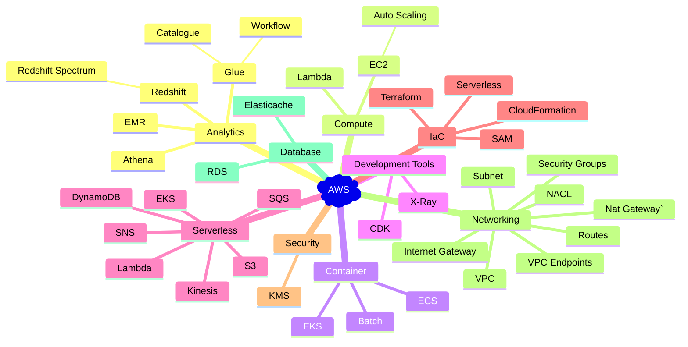

### Hi there 👋, I am Subhamay Bhattacharyya, 4x AWS Certified and a AWS Cloud Enthusiast

```mermaid
mindmap
  id)AWS(
    Analytics
      Redshift
        Redshift Spectrum 
      Athena
      Glue
        Catalogue
        Workflow
      EMR
    Compute
      Lambda
      EC2
        Auto Scaling
    Container
      ECS
      EKS
      Batch
    Development Tools
      X-Ray
      CDK
    Serverless
      Lambda
      EKS
      Kinesis
      S3
      SNS
      SQS
      DynamoDB
    IaC
      CloudFormation
      SAM
      Terraform
      Serverless
    Security
      KMS
    Networking
      VPC
      Subnet
      Routes
      Internet Gateway
      Nat Gateway`
      VPC Endpoints
      NACL
      Security Groups
    Database
      RDS
      Elasticache


```

<!--
**bsubhamay/bsubhamay** is a ✨ _special_ ✨ repository because its `README.md` (this file) appears on your GitHub profile.
-->
<table cellspacing="0" cellpadding="0" style="border-collapse: collapse; border: none; width:440px">
    <tr style="border: none; width:440px">
        <td style="border: none; width:110px"></td>
        <td style="border: none; width:110px"></td>
        <td style="border: none; width:110px"></td>
        <td style="border: none; width:110px"></td>
        <td style="border: none; width:110px"></td>
     </tr>
</table>
    <!-- <tr style="border: none;">
        <td colwidth="20%" style="border: none;"></td>
        <td colwidth="20%" style="border: none;"></td>
        <td colwidth="20%" style="border: none;"></td>
        <td colwidth="20%" style="border: none;"></td>
        <td colwidth="20%" style="border: none;"></td>
    </tr>
    <tr style="border: none;">
        <td colwidth="20%" style="border: none;"></td>
        <td colwidth="20%" style="border: none;"></td>
        <td colwidth="20%" style="border: none;"></td>
        <td colwidth="20%" style="border: none;"></td>
        <td colwidth="20%" style="border: none;"></td>
    </tr>
    <tr style="border: none;">
        <td colwidth="20%" style="border: none;"></td>
        <td colwidth="80%" style="border: none;">&nbsp;</td>
    </tr>
</table>-->

- 🔭 I'm currently working as a Senior Manager at Capgemni for a legacy to AWS cloud data migration project.
- 💾 I've overall 23+ years of experience of which 2 years in desktop/client-server application development,16 years as an Oracle ERP technical consultant and 5 years as AWS Cloud Data Engineer.
- 🌱 I'm currenly learning Terraform, SAM and Serverless Framework and GitHub Actions and Workflows. The list of my personal projects can be founnd at the bottom of this page
- 👯 I’m looking to collaborate on creating serverless patterns
- 🤔 I’m looking for help with Kubernetes
- 💬 Ask me about my upcoming projects
- 📫 How to reach me : subhamay.aws@gmail.com
- 😄 Pronouns: He/His/Him
- ⚡ Fun fact: Love to play cuddle my cats Samsung and Thomas.

<h3 align="left">Languages and Tools:</h3>

         

&nbsp;

## Reusable CI/CD Workflows:
|Sr#|Cloud Service Provider|IaC|Project Description|Repository|Status|
|---   |---	|---	|---	|---	|---	|
|1.|||Reusable GitHub Workflows for AWS using Terraform|gh-action-reusable-aws-tf-wf|||
|2.|||Reusable GitHub Workflows for Azure using Terraform|gh-action-reusable-az-tf-wf|||
|3.|||Reusable GitHub Workflows for GCP using Terraform|gh-action-reusable-gcp-tf-wf|||

## GitHub Template Repositories:
|Sr#|Cloud Service Provider|IaC|Project Description|Repository|Status|
|---   |---	|---	|---	|---	|---	|
|1.|||Repository Template for Terraform AWS|terraform-aws-template|||
|2.|||Repository Template for Terraform Azure|terraform-azure-template|||
|3.|||Repository Template for Terraform GCP|terraform-gcp-template|||

## Boot Camps:

|Sr#|Project Name|Project Description|Repository|Status|Progress|IaC|
|---   |---	|---	|---	|---	|---	|---	|
|1.|GitOps Minicamp|GitOps Minicamp - build a fully functional GitOps pipeline to deploy AWS infrastructure using Terraform conducted by Derek Morgan and Andrew Brown.|gitops-minicamp-2024-tf||||

## My Current and upcoming projects:

|Sr#|Code|Project Name|Project Description|Repository|Status|Progress|IaC|
|---   |---	|---	|---	|---	|---	|---	|--- |
|1.|0001|Tarius|This project implements a serverless architecture to facilitate the real-time loading of data into _**Amazon DynamoDB**_ from a private S3 bucket. The solution leverages AWS Lambda running inside private subnets within a Virtual Private Cloud (VPC) to ensure secure and scalable data processing.|0001-tarius-py-cft||||
|2.|0004|Capricorn|Loading data into DynamoDB from S3 using Lambda running in private only subnets , triggered via S3 event notification.|0004-capricorn-py-tf||||
|3.|0027|Scilla|AWS Immersion Day - AWS Networking - VPC fundamentals.|0027-scilla-tf||||
|4.|0030|Ballota|S3 Security Best Practice.|0030-ballota-tf||||
|5.|0032|Allium|Mounting an Elastic File System to multipe EC2 instances.|0032-allium-tf||||
|6.|0034|Aster|Loading data into DynamoDB Global Table with KMS encryption enabled using Kinesis-Lambda.|0034-aster-py-tf||||
|7.|0038|Bellflower|Step Function with Lambda, SNS, SQS, S3 orchestration with callback functionality.|0038-bellflower-tf||||
|8.|0048|Alstroemeria|Event-driven architecture using AmazonSNS and SQS.|0048-alstroemeria-tf||||
|9.|0051|Fuchsia|Crawling internal and external data sources using Glue Crawler and use Athena for analysis..|0051-fuchsia-tf||||
|10.|0052|Agapanthus|Working with Glue Data Catalog and Running the Glue Crawler On Demand.|0052-agapanthus-tf||||
|11.|0053|Bluebonnets|Working with Glue Data Catalog and running the same  using S3 Event Notification and SQS.|0053-bluebonnets-tf||||
|12.|0097|Heliotrope|Introduction to Serverless using DynamoDB, Lambda and API Gateway.|0097-helitrope-tf||||
|13.|0104|Lupin|Creating a custom VPC with public and private subnets and nat gateway to access internet from private subnet. Create VPC endpoint for S3 and KMS and create EC2 instances in the public and private subnets and test the connectivity.|0104-lupin-tf||||
|14.|0116|Mandevilla|Event Driven Architecture using EventBridge, SNS, SQS and StepFunction.|0116-mandevilla-tf||||
|15.|0117|Marigold|Athena basics with custom named query and workgroups..|0117-marigold-tf||||
|16.|0118|Matthiola|VPC Peering .|0118-matthiola-tf||||
|17.|0119|Mayflower|Extract , Transform and load using Glue.|0119-mayflower-tf||||
|18.|0120|Mimosa|Implementing AWS Control.|0120-mimosa-tf||||
|19.|0121|Moraea|EventBridge rule with different targets.|0121-moraea-tf||||
|20.|0122|Nemesia|Working with Glue Workflow.|0122-nemesia-tf||||
|21.|0123|Nemophila|Querying a DynamoDB table using Athena.|0123-nemophila-tf||||

## Terraform Private Registry Modules:
|Sr#|Category|Service|Repository|Latest Release|Status|
|---   |---	|---	|---	|---	|---	|
|1 |Networking|VPC-Subnets|terraform-aws-vpc-subnets|1.0.0||
|2 |Networking|Security Group|terraform-aws-security-group|1.0.0||
|3|Storage|S3 Bucket|terraform-aws-s3|1.0.0||
|4|Analytics|Glue Crawler|terraform-aws-glue-crawler|1.0.0||
|5|Analytics|Glue Database|terraform-aws-glue-database|1.0.0||
|6|Analytics|Glue Job Security Configuration|terraform-aws-glue-security-configuration|1.0.0||
|7|Analytics|Glue Job|terraform-aws-glue-job|1.0.0||
|8|Analytics|Glue Catalog Database|terraform-aws-glue-database|1.0.0||

