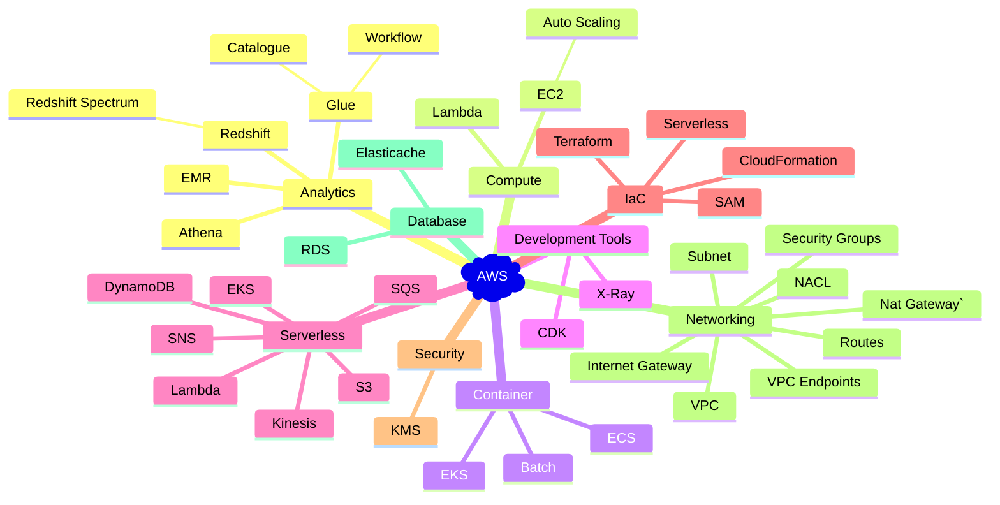

### Hi there 👋, I am Subhamay Bhattacharyya, 4x AWS Certified and a AWS Cloud Enthusiast

```mermaid
mindmap
  id)AWS(
    Analytics
      Redshift
        Redshift Spectrum 
      Athena
      Glue
        Catalogue
        Workflow
      EMR
    Compute
      Lambda
      EC2
        Auto Scaling
    Container
      ECS
      EKS
      Batch
    Development Tools
      X-Ray
      CDK
    Serverless
      Lambda
      EKS
      Kinesis
      S3
      SNS
      SQS
      DynamoDB
    IaC
      CloudFormation
      SAM
      Terraform
      Serverless
    Security
      KMS
    Networking
      VPC
      Subnet
      Routes
      Internet Gateway
      Nat Gateway`
      VPC Endpoints
      NACL
      Security Groups
    Database
      RDS
      Elasticache


```

<!--
**bsubhamay/bsubhamay** is a ✨ _special_ ✨ repository because its `README.md` (this file) appears on your GitHub profile.
-->
<table cellspacing="0" cellpadding="0" style="border-collapse: collapse; border: none; width:440px">
    <tr style="border: none; width:440px">
        <td style="border: none; width:110px"></td>
        <td style="border: none; width:110px"></td>
        <td style="border: none; width:110px"></td>
        <td style="border: none; width:110px"></td>
     </tr>
</table>
    <!-- <tr style="border: none;">
        <td colwidth="20%" style="border: none;"></td>
        <td colwidth="20%" style="border: none;"></td>
        <td colwidth="20%" style="border: none;"></td>
        <td colwidth="20%" style="border: none;"></td>
        <td colwidth="20%" style="border: none;"></td>
    </tr>
    <tr style="border: none;">
        <td colwidth="20%" style="border: none;"></td>
        <td colwidth="20%" style="border: none;"></td>
        <td colwidth="20%" style="border: none;"></td>
        <td colwidth="20%" style="border: none;"></td>
        <td colwidth="20%" style="border: none;"></td>
    </tr>
    <tr style="border: none;">
        <td colwidth="20%" style="border: none;"></td>
        <td colwidth="80%" style="border: none;">&nbsp;</td>
    </tr>
</table>-->

- 🔭 I'm currently working as a Senior Manager at Capgemni for a legacy to AWS cloud data migration project.
- 💾 I've overall 23+ years of experience of which 2 years in desktop/client-server application development,16 years as an Oracle ERP technical consultant and 5 years as AWS Cloud Data Engineer.
- 🌱 I'm currenly learning Terraform, SAM and Serverless Framework and GitHub Actions and Workflows. The list of my personal projects can be founnd at the bottom of this page
- 👯 I’m looking to collaborate on creating serverless patterns
- 🤔 I’m looking for help with Kubernetes
- 💬 Ask me about my upcoming projects
- 📫 How to reach me : subhamay.aws@gmail.com
- 😄 Pronouns: He/His/Him
- ⚡ Fun fact: Love to play cuddle my cats Samsung and Thomas.

<h3 align="left">Languages and Tools:</h3>

         

&nbsp;

## My Current and upcoming projects:

|Sr#|Code|Project Name|Project Description|Repository|Status|
|---   |---	|---	|---	|---	|---	|
|1.|0001|Tarius|Loading data into DynamoDB from S3 using Lambda running in private only subnets , triggered via S3 event notification.|0001-tarius-py-cft||
|2.|0030|Ballota|S3 Security Best Practice.|0030-ballota-cft||
|3.|0027|Scilla|AWS Immersion Day - Basic VPC Networking.|0027-scilla-tf||
|4.|0032|Allium|Mounting an Elastic File System to multipe EC2 instances.|0032-allium-cft||
|5.|0052|Agapanthus|Glue crawler generating JSON and CSV file metadata from S3 bucket in a secured S3 bucket.|0052-agapanthus-cft||

