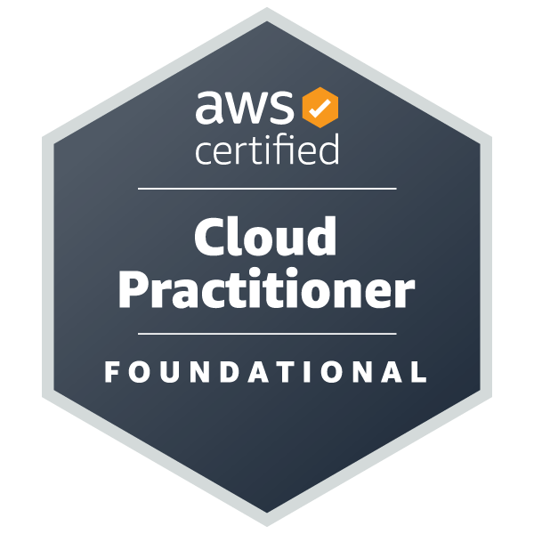
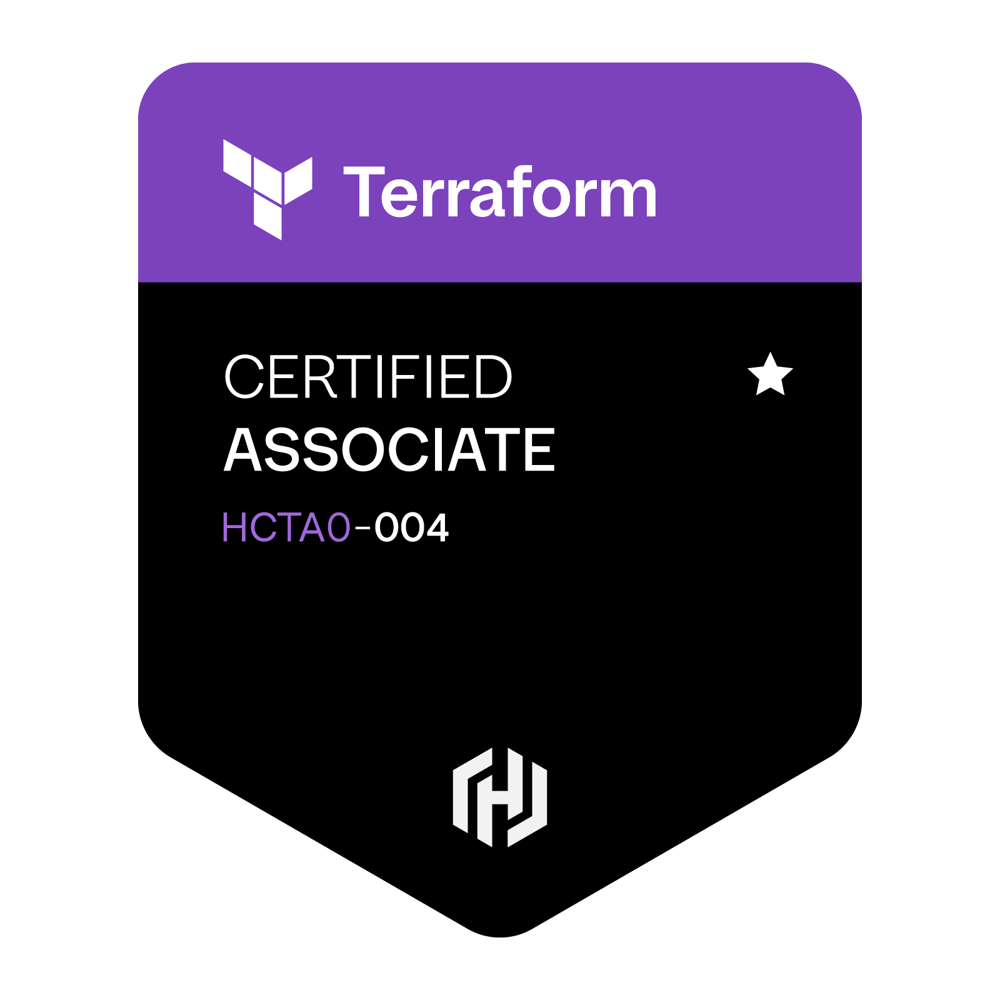
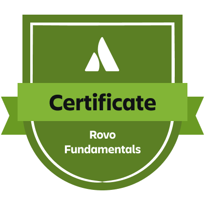
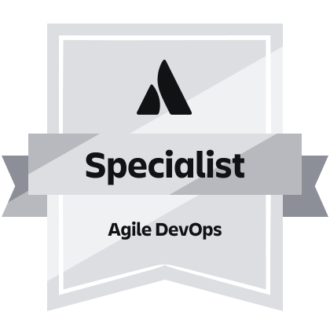
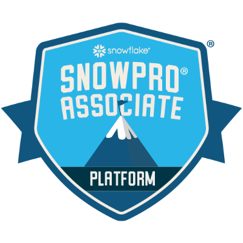
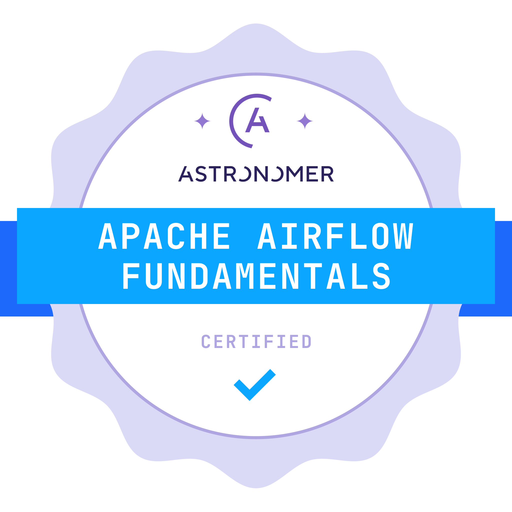
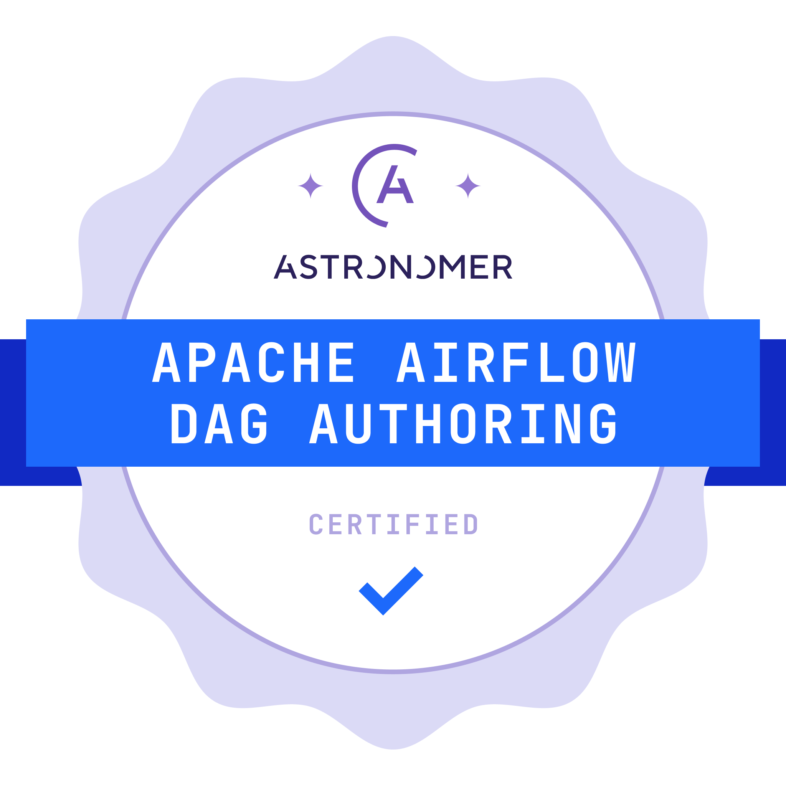

# Subhamay Bhattacharyya

### Hi there 👋, I am Subhamay Bhattacharyya, 7x AWS, 1x Azure, 2x GitHub and 1x HashiCorp Terraform, 4 x Snowflake and 1 x Databricks Certified, 2 x Astronomer and 5x Atlassian Certified Data Engineer and a AWS Cloud Enthusiast

  

I'm a Senior Manager & Cloud Data Engineer with a strong focus on **multi-cloud architecture, DevOps automation, and data platforms**. I build **production-grade cloud systems** across **AWS, Azure, and GCP** using **Terraform, GitHub Actions, Ansible, and serverless services**, with a deep emphasis on **security, observability, and cost-efficient design**.

My work blends **hands-on engineering** with **architectural leadership**—from designing **event-driven data pipelines** and **cloud-native analytics platforms** to building **enterprise-ready CI/CD pipelines** using **OIDC-based zero-trust authentication** and **infrastructure-as-code**.

---

## 🚀 What I’m Building  

I’m currently developing a **multi-cloud Cloud Resume Challenge platform**, where the same production-grade architecture is deployed on:

- **AWS** — S3, CloudFront, Route 53, Lambda, DynamoDB, Kinesis, RDS, VPC, EC2, Athena, API Gateway, Glue, Step Functions, SNS, SQS, EventBridge, CloudWatch, IAM, KMS, Secrets Manager  
- **GCP** — Cloud Storage, Cloud CDN, Cloud DNS, Workload Identity Federation  
- **Azure** — Storage Static Website, Azure Front Door, Azure DNS  

Everything is provisioned using **Terraform modules**, deployed via **GitHub Actions with OIDC**, and validated with **Ansible-driven configuration management**—mirroring how real-world cloud platforms are built and operated.

Alongside this, I build **reusable GitHub Actions**, **Terraform modules**, and **data engineering pipelines** for AWS Glue, Snowflake, BigQuery, and Azure Data Factory.

---

## 🧠 What I Specialize In  

- **Multi-cloud Infrastructure as Code** (Terraform, HCP Terraform, GitHub OIDC)  
- **Serverless & Event-Driven Architectures** (Lambda, Glue, Kinesis, Pub/Sub, Dataflow)  
- **Data Engineering Platforms** (Snowflake, BigQuery, Athena, Glue, DMS)  
- **CI/CD & Platform Engineering** (GitHub Actions, reusable workflows, DevContainers)  
- **Security & Observability** (OIDC, IAM federation, Honeycomb, Splunk, lineage tracking)  

---

## 🏅 Continuous Learning  

I actively maintain a broad certification portfolio across **AWS, Azure, GCP, Snowflake, GitHub, and Terraform**, using them as a way to validate and deepen real-world engineering skills—not just theory.

---

## 🎯 My Goal  

To design and operate **cloud platforms that are secure, automated, observable, and scalable by default**—and to build public, open-source projects that demonstrate what **modern cloud engineering** really looks like in practice.

## 🏆 Professional Certificates

<h3 style="display:inline;">AWS Certifications (10)</h3>

<table style="width:100%; border-collapse:collapse; margin:8px 0 16px 0; border:none">
  <tr>
    <td style="text-align:center; padding:10px;"> Valid till: Apr 18, 2029</td>
    <td style="text-align:center; padding:10px;"> Valid till: Jun 14, 2028</td>
    <td style="text-align:center; padding:10px;"> Valid till: May 31, 2028</td>
    <td style="text-align:center; padding:10px;"> Valid till: Aug 16, 2028</td>
    <td style="text-align:center; padding:10px;"> Preparing</td>
  </tr>
  <tr>
    <td style="text-align:center; padding:10px;"> Valid till: Dec 20, 2027</td>
    <td style="text-align:center; padding:10px;"> Valid till: Apr 18, 2029</td>
    <td style="text-align:center; padding:10px;"> Valid till: Jul 25, 2029</td>
    <td style="text-align:center; padding:10px;"> Preparing</td>
    <td style="text-align:center; padding:10px;"> Preparing</td>
  </tr>
</table>

<h3 style="display:inline;">Other Cloud Platform Certifications (3)</h3>

<table style="width:auto; border-collapse:collapse; margin:8px 0 16px 0; border:none">
  <tr>
    <td style="text-align:center; padding:10px;"> Valid till: Dec 20, 2028</td>
    <td style="text-align:center; padding:10px;"> Valid till: 2026-07-29</td>
    <td style="text-align:center; padding:10px;"> Issued: Dec 18, 2021 | No Expiry</td>
  </tr>
</table>

<h3 style="display:inline;">CI/CD Certifications (3)</h3>

<table style="width:auto; border-collapse:collapse; margin:8px 0 16px 0; border:none">
  <tr>
    <td style="text-align:center; padding:10px;"> Valid till: May 28, 2028</td>
    <td style="text-align:center; padding:10px;"> Valid till: Jun 28, 2028</td>
    <td style="text-align:center; padding:10px;"> Valid till: Apr 1, 2028</td>
  </tr>
</table>

<h3 style="display:inline;">Claude Certifications (1)</h3>

<table style="width:auto; border-collapse:collapse; margin:8px 0 16px 0; border:none">
  <tr>
    <td style="text-align:center; padding:10px;"> Valid till: Aug 28, 2027</td>
  </tr>
</table>

<h3 style="display:inline;">Atlassian Certifications (5)</h3>

<table style="width:100%; border-collapse:collapse; margin:8px 0 16px 0; border:none">
  <tr>
    <td style="text-align:center; padding:10px;"> Valid till: 2028-10-21</td>
    <td style="text-align:center; padding:10px;"> Valid till: 2028-10-16</td>
    <td style="text-align:center; padding:10px;"> Valid till: 2028-09-26</td>
    <td style="text-align:center; padding:10px;"> Valid till: 2027-07-24</td>
    <td style="text-align:center; padding:10px;"> Valid till: 2027-07-24</td>
  </tr>
</table>

<h3 style="display:inline;">Data and Analytics Certifications (5)</h3>

<table style="width:100%; border-collapse:collapse; margin:8px 0 16px 0; border:none">
  <tr>
    <td style="text-align:center; padding:10px;"> Valid till: March 13, 2028</td>
    <td style="text-align:center; padding:10px;"> Valid till: June 13, 2028</td>
    <td style="text-align:center; padding:10px;"> Valid till: June 13, 2028</td>
    <td style="text-align:center; padding:10px;"> Valid till: June 13, 2028</td>
    <td style="text-align:center; padding:10px;"> Valid till: January 31, 2028</td>
  </tr>
</table>

<h3 style="display:inline;">Workflow Engineering Certifications (2)</h3>

<table style="width:auto; border-collapse:collapse; margin:8px 0 16px 0; border:none">
  <tr>
    <td style="text-align:center; padding:10px;"> Issued: Nov 10, 2025 | No Expiry</td>
    <td style="text-align:center; padding:10px;"> Issued: Nov 16, 2025 | No Expiry</td>
  </tr>
</table>

---

---

## 📦 Repository Categories

**Legend:** ⚪ Initialized &nbsp; 🟡 In Progress &nbsp; 🟢 Complete &nbsp; 🔴 Blocked

<h3 style="display: inline;">☁️ Terraform Template Repository (6)</h3>

| # | Repository | Description |  ||| |
|---|------------|-------------|-------------------|----------------|-------------|----------------|
| 1 | 🟢 [terraform-snowflake-module-template](https://github.com/subhamay-bhattacharyya-tf/terraform-snowflake-module-template)   &nbsp;| ✅ Terraform Snowflake module GitHub repository template &nbsp;&nbsp; | 9 | 8 | 8 | 511 KB |
| 2 | 🟢 [terraform-aws-module-template](https://github.com/subhamay-bhattacharyya-tf/terraform-aws-module-template)   &nbsp;| ✅ A GitHub template repository for bootstrapping reusable Terraform AWS modules. Provides a standardized layout with submodules, examples, Terratest integration tests, CI workflows using OIDC, semantic-release, and Conventional Commits — so new AWS modules start with consistent structure, validation, and release automation. &nbsp;&nbsp; | 8 | 7 | 7 | 637 KB |
| 3 | 🟢 [terraform-google-module-template](https://github.com/subhamay-bhattacharyya-tf/terraform-google-module-template)   &nbsp;| ✅ A reusable, opinionated Terraform module template for provisioning and managing Google Cloud Platform resources — designed for consistency, scalability, and best practices. &nbsp;&nbsp; | 6 | 5 | 5 | 414 KB |
| 4 | ⚪ [terraform-template](https://github.com/subhamay-bhattacharyya/terraform-template)   Not available&nbsp;| 📄🎯 GitHub Repository Template for Terraform as IaC. &nbsp;&nbsp; | 4 | 3 | 2 | 324 KB |
| 5 | 🟡 [terraform-google-service-demo](https://github.com/subhamay-bhattacharyya/terraform-google-service-demo)   Not available&nbsp;| 🏗️ A template repository to be used to create Google Services Demo &nbsp;&nbsp; | 2 | 1 | 1 | 106 KB |
| 6 | ⚪ [claude-terraform-aws-template](https://github.com/subhamay-bhattacharyya/claude-terraform-aws-template)   Not available&nbsp;| roduction-ready Terraform template for AWS. Includes CI/CD workflows, pre-commit hooks, security scanning, and conventions for scalable IaC deployments. Use as a starting point for new infrastructure projects across cloud providers and data platforms. &nbsp;&nbsp; | 1 | 0 | 0 | 14 KB |

<h3 style="display: inline;">☁️ Google Cloud Platform - Terraform (21)</h3>

| # | Repository | Description |  ||| |
|---|------------|-------------|-------------------|----------------|-------------|----------------|
| 1 | ⚪ [terraform-gcp-practice](https://github.com/subhamay-bhattacharyya/terraform-gcp-practice)   Not available&nbsp;| Terraform with GCP practice &nbsp;&nbsp; | 4 | 3 | 3 | 219 KB |
| 2 | ⚪ [gcp-webhook-to-slack-function](https://github.com/subhamay-bhattacharyya/gcp-webhook-to-slack-function)   Not available&nbsp;| Provision a Google Cloud project and deploy a Python HTTP Cloud Function with Terraform + GitHub Actions. The function is invoked by a GitHub Webhook and posts event notifications to a Slack channel via Slack API. &nbsp;&nbsp; | 3 | 3 | 2 | 166 KB |
| 3 | ⚪ [terraform-gcp-lab-01-gce](https://github.com/subhamay-bhattacharyya/terraform-gcp-lab-01-gce)   Not available&nbsp;| This repository is part of a hands-on Terraform learning series for Google Cloud Platform (GCP). Lab 01 focuses on provisioning and managing Google Compute Engine (GCE) virtual machines using Terraform, following infrastructure-as-code (IaC) best practices. &nbsp;&nbsp; | 3 | 2 | 1 | 274 KB |
| 4 | 🟡 [terraform-bigtable-demo](https://github.com/subhamay-bhattacharyya/terraform-bigtable-demo)   Not available&nbsp;| 🏗️ ⌾ Terraform demo project provisioning a Google Cloud Bigtable instance, clusters, and tables on GCP with configurable node scaling, SSD and HDD storage types, multi-cluster replication, IAM access control, app profiles, routing policies, column families, and garbage collection policies for high-throughput wide-column and time-series workloads. &nbsp;&nbsp; | 2 | 2 | 1 | 45 KB |
| 5 | 🟡 [terraform-bigquery-demo](https://github.com/subhamay-bhattacharyya/terraform-bigquery-demo)   Not available&nbsp;| 🏗️ ⌾Terraform demo project provisioning a Google Cloud BigQuery dataset and tables on GCP with configurable access controls, time and range partitioning, column clustering, schema management, customer-managed encryption keys, dataset-level IAM bindings, authorized views, and automated table expiration policies for scalable analytics workloads. &nbsp;&nbsp; | 2 | 2 | 1 | 45 KB |
| 6 | 🟡 [terraform-gce-demo](https://github.com/subhamay-bhattacharyya/terraform-gce-demo)   Not available&nbsp;| 🏗️ ⌾ Terraform demo project provisioning a Google Compute Engine instance on GCP with configurable machine type, disk type and size, custom metadata, startup scripts, network tags, IAM service account bindings, firewall rules, SSH access controls, static IP reservation, and automated snapshot scheduling for scalable and secure VM workloads. &nbsp;&nbsp; | 2 | 2 | 1 | 45 KB |
| 7 | 🟡 [terraform-cloud-function-demo](https://github.com/subhamay-bhattacharyya/terraform-cloud-function-demo)   Not available&nbsp;| 🏗️ ⌾ Terraform demo project provisioning a Google Cloud Function on GCP with configurable runtime, memory and timeout settings, environment variables, IAM invoker bindings, event-driven and HTTP triggers, source bucket deployment, VPC connector integration, and secret manager references for serverless workloads. &nbsp;&nbsp; | 2 | 2 | 1 | 45 KB |
| 8 | 🟡 [terraform-cloud-sql-demo](https://github.com/subhamay-bhattacharyya/terraform-cloud-sql-demo)   Not available&nbsp;| 🏗️ ⌾ Terraform demo project provisioning a Google Cloud SQL instance on GCP with configurable database engine, tier and edition, high availability, automated backups, point-in-time recovery, private IP and VPC peering, IAM database authentication, SSL enforcement, and maintenance window settings for managed relational workloads. &nbsp;&nbsp; | 2 | 2 | 1 | 45 KB |
| 9 | 🟡 [terraform-cloud-spanner-demo](https://github.com/subhamay-bhattacharyya/terraform-cloud-spanner-demo)   Not available&nbsp;| 🏗️ ⌾ Terraform demo project provisioning a Google Cloud Spanner instance and database on GCP with configurable processing units, multi-region and single-region configurations, IAM access control, schema definitions, backup schedules, retention policies, and query optimizer settings for globally distributed relational workloads. &nbsp;&nbsp; | 2 | 2 | 1 | 45 KB |
| 10 | 🟡 [terraform-cloud-datastore-demo](https://github.com/subhamay-bhattacharyya/terraform-cloud-datastore-demo)   Not available&nbsp;| 🏗️ ⌾ Terraform demo project provisioning a Google Cloud Datastore database on GCP with configurable native and datastore modes, multi-region and single-region locations, IAM access control, collection and document structure, TTL policies, backup schedules, and field-level index configurations for serverless NoSQL workloads. &nbsp;&nbsp; | 2 | 2 | 1 | 45 KB |
| 11 | 🟡 [terraform-cloud-firestore-demo](https://github.com/subhamay-bhattacharyya/terraform-cloud-firestore-demo)   Not available&nbsp;| 🏗️ ⌾Terraform demo project provisioning a Google Cloud Firestore database on GCP with configurable native and datastore modes, multi-region and single-region locations, IAM access control, document and collection structure, TTL policies, automated backup schedules, and composite index configurations for scalable serverless NoSQL workloads. &nbsp;&nbsp; | 2 | 2 | 1 | 45 KB |
| 12 | 🟡 [terraform-dataflow-demo](https://github.com/subhamay-bhattacharyya/terraform-dataflow-demo)   Not available&nbsp;| 🏗️ ⌾ Terraform demo project provisioning a Google Cloud Dataflow job on GCP with configurable streaming and batch pipelines, worker machine type, autoscaling, custom parameters, temp and staging bucket settings, IAM service account bindings, network and subnetwork configuration, and Flex Template support for managed data processing workloads. &nbsp;&nbsp; | 2 | 2 | 1 | 45 KB |
| 13 | 🟡 [terraform-alloydb-demo](https://github.com/subhamay-bhattacharyya/terraform-alloydb-demo)   Not available&nbsp;| 🏗️ ⌾ Terraform demo project provisioning a Google Cloud AlloyDB cluster and instance on GCP with configurable primary and read pool instances, automated backups, point-in-time recovery, private IP and VPC peering, IAM authentication, SSL enforcement, maintenance windows, and high availability settings for PostgreSQL-compatible workloads. &nbsp;&nbsp; | 2 | 2 | 1 | 45 KB |
| 14 | 🟡 [terraform-dataproc-demo](https://github.com/subhamay-bhattacharyya/terraform-dataproc-demo)   Not available&nbsp;| 🏗️⌾Terraform demo project provisioning a Google Cloud Dataproc cluster on GCP with configurable master and worker node types, autoscaling policies, initialization actions, custom metadata, Kerberos security, IAM service account bindings, staging bucket settings, and optional Spark and Hadoop component configuration for managed data processing work &nbsp;&nbsp; | 2 | 2 | 1 | 45 KB |
| 15 | 🟡 [terraform-vpc-subnet-demo](https://github.com/subhamay-bhattacharyya/terraform-vpc-subnet-demo)   Not available&nbsp;| 🏗️ ⌾ Terraform demo project provisioning a Google Cloud VPC network and subnets on GCP with configurable primary and secondary IP ranges, private Google access, flow logs, firewall rules, Cloud NAT, shared VPC, VPC peering, IAM bindings, and subnet-level access controls for scalable and secure network infrastructure workloads. &nbsp;&nbsp; | 2 | 2 | 1 | 45 KB |
| 16 | 🟡 [terraform-kms-demo](https://github.com/subhamay-bhattacharyya/terraform-kms-demo)   Not available&nbsp;| 🏗️ ⌾ Terraform demo project provisioning a Google Cloud KMS key ring and crypto keys on GCP with configurable key rotation periods, protection levels, encryption algorithms, IAM access control, automatic and manual key rotation, import jobs, crypto key versions, and destroy scheduled duration for secure key management workloads. &nbsp;&nbsp; | 2 | 2 | 1 | 45 KB |
| 17 | 🟡 [terraform-compute-mig-demo](https://github.com/subhamay-bhattacharyya/terraform-compute-mig-demo)   Not available&nbsp;| 🏗️⌾Terraform demo project provisioning a Google Cloud Managed Instance Group on GCP with configurable instance templates, autoscaling policies, health checks, rolling update strategies, named ports, stateful disks, IAM service account bindings, multi-zone distribution, and load balancer integration for scalable and resilient compute workloads. &nbsp;&nbsp; | 2 | 2 | 1 | 45 KB |
| 18 | 🟡 [terraform-iam-demo](https://github.com/subhamay-bhattacharyya/terraform-iam-demo)   Not available&nbsp;| 🏗️ ⌾Terraform demo project provisioning Google Cloud IAM resources on GCP with service accounts, project IAM bindings, custom roles, IAM conditions, workload identity federation, service account impersonation, audit logging, organisation policy constraints, and IAM deny policies for secure access control. &nbsp;&nbsp; | 2 | 2 | 1 | 45 KB |
| 19 | 🟢 [gcp-terraform-bootstrap](https://github.com/subhamay-bhattacharyya/gcp-terraform-bootstrap)   &nbsp;| ✅ Bootstrap Google Cloud projects using Terraform with secure, keyless authentication via GitHub Actions OIDC and Workload Identity Federation, and remote state management using HCP Terraform. &nbsp;&nbsp; | 1 | 1 | 0 | 114 KB |
| 20 | 🟡 [terraform-gcs-bucket-demo](https://github.com/subhamay-bhattacharyya/terraform-gcs-bucket-demo)   Not available&nbsp;| 🏗️ ⌾ Terraform demo project provisioning a Google Cloud Storage bucket on GCP with configurable storage class, regional and multi-regional placement, IAM access control, customer-managed encryption, object versioning, retention policies, and automated lifecycle management rules.  📝 Basic and Lifecycle enabled. Need to create others. &nbsp;&nbsp; | 2 | 1 | 0 | 56 KB |
| 21 | 🟡 [terraform-pubsub-demo](https://github.com/subhamay-bhattacharyya/terraform-pubsub-demo)   Not available&nbsp;| 🏗️ ⌾ Terraform demo project provisioning a Google Cloud Pub/Sub topic and subscription with configurable message retention policies, acknowledgment deadlines, dead-letter queue support, IAM access control, message filtering, ordering keys, push and pull subscription delivery options, retry policies, and topic-level encryption using KMS keys. &nbsp;&nbsp; | 2 | 1 | 0 | 46 KB |

<h3 style="display: inline;">☁️ Amazon Web Services - Terraform (11)</h3>

| # | Repository | Description |  ||| |
|---|------------|-------------|-------------------|----------------|-------------|----------------|
| 1 | ⚪ [aws-receipt-processing-system](https://github.com/subhamay-bhattacharyya/aws-receipt-processing-system)   Not available&nbsp;| 🏗️ Serverless, event-driven receipt processing system on AWS. Users upload receipts to Amazon S3, which triggers a Lambda function to extract structured data via Amazon Textract, persist results to DynamoDB, and dispatch email notifications through Amazon SES. Fully infrastructure-as-code managed for reproducible deployments. &nbsp;&nbsp; | 4 | 3 | 3 | 219 KB |
| 2 | ⚪ [aws-two-tier-todo-app](https://github.com/subhamay-bhattacharyya/aws-two-tier-todo-app)   Not available&nbsp;| 🏗️ Highly available two-tier Todo web application on AWS. Deploys an Application Load Balancer fronting EC2 instances across two Availability Zones, with Amazon RDS hosted in private subnets for secure data persistence. Includes VPC, subnets, route tables, and security groups — all provisioned via infrastructure-as-code. &nbsp;&nbsp; | 4 | 3 | 3 | 219 KB |
| 3 | ⚪ [serverless-cloud-dictionary](https://github.com/subhamay-bhattacharyya/serverless-cloud-dictionary)   Not available&nbsp;| 🏗️ Serverless cloud terminology dictionary on AWS. A React frontend hosted on AWS Amplify queries an API Gateway endpoint backed by a Lambda function that fetches term definitions from DynamoDB. Includes a CLI-driven bulk loader using batch-write-item to seed the dataset, with the full stack provisioned via infrastructure-as-code. &nbsp;&nbsp; | 4 | 3 | 3 | 219 KB |
| 4 | ⚪ [aws-event-announcement-site](https://github.com/subhamay-bhattacharyya/aws-event-announcement-site)   Not available&nbsp;| 🏗️ Serverless event announcement website on AWS, fully event-driven from end to end. A static S3-hosted frontend calls API Gateway endpoints backed by Lambda functions to register events and capture subscribers, with Amazon SNS dispatching email notifications and events.json in S3 acting as the source of truth — all provisioned as code. &nbsp;&nbsp; | 4 | 3 | 3 | 219 KB |
| 5 | ⚪ [aws-data-lake-cart-abandonment](https://github.com/subhamay-bhattacharyya/aws-data-lake-cart-abandonment)   Not available&nbsp;| 🏗️ Layered AWS data lake for analyzing e-commerce cart abandonment. Raw events from the backend land in an S3 raw zone, EventBridge-triggered Lambda functions process and aggregate them into a consumption zone, and a promotions Lambda reads the curated data to generate targeted discount offers for customers. Built as an AWS SimuLearn solution. &nbsp;&nbsp; | 4 | 3 | 3 | 219 KB |
| 6 | 🟡 [aws-athena-iceberg-demo](https://github.com/subhamay-bhattacharyya/aws-athena-iceberg-demo)   Not available&nbsp;| A hands-on demo showcasing Apache Iceberg tables on Amazon S3 queried using Amazon Athena, with table creation, schema evolution, and partitioned analytics.  📝 Done - S3 bucket created. Next - Create Athena tables &nbsp;&nbsp; | 4 | 3 | 2 | 172 KB |
| 7 | 🟡 [s3-storage-best-practice](https://github.com/subhamay-bhattacharyya/s3-storage-best-practice)   Not available&nbsp;| S3 Security Best Practices using Terraform.  📝 Terraform test not added to CI pipeline &nbsp;&nbsp; | 3 | 3 | 2 | 339 KB |
| 8 | ⚪ [terraform-aws-iceberg-table](https://github.com/subhamay-bhattacharyya/terraform-aws-iceberg-table)   Not available&nbsp;| Terraform project to provision Apache Iceberg tables on AWS S3 using AWS Glue Data Catalog, integrating S3 storage, Glue databases, catalog tables, and crawlers for a scalable data lakehouse architecture. &nbsp;&nbsp; | 4 | 3 | 2 | 327 KB |
| 9 | ⚪ [aws-serverless-security](https://github.com/subhamay-bhattacharyya/aws-serverless-security)   Not available&nbsp;| 🏗️ Hands-on workshop to secure a serverless AWS application across seven defense-in-depth layers using AI-powered automation. Covers Cognito adaptive auth, WAF edge protection, VPC isolation, Lambda hardening with Kiro, Secrets Manager, DynamoDB encryption, and a Bedrock AI agent for GuardDuty incident response via EventBridge. &nbsp;&nbsp; | 2 | 1 | 0 | 180 KB |
| 10 | ⚪ [aws-csv-data-pipeline](https://github.com/subhamay-bhattacharyya/aws-csv-data-pipeline)   Not available&nbsp;| 🏗️ Serverless, event-driven data pipeline on AWS for processing CSV files end-to-end. Raw uploads to S3 trigger a Lambda preprocessor, AWS Glue crawls and catalogs the cleaned data, a Glue ETL job transforms it into the final dataset, and Amazon QuickSight delivers interactive dashboards for analytics and reporting. &nbsp;&nbsp; | 1 | 1 | 0 | 255 KB |
| 11 | ⚪ [secure-website-oac-waf](https://github.com/subhamay-bhattacharyya/secure-website-oac-waf)   Not available&nbsp;| 🏗️ Secure, serverless static website hosted on AWS S3 with CloudFront, Origin Access Control, and HTTPS enforced. Protected by AWS WAF against SQLi, XSS, bots, and malicious traffic, with least-privilege IAM policies across all resources. CloudWatch and CloudTrail provide full logging, monitoring, and anomaly detection. &nbsp;&nbsp; | 1 | 1 | 0 | 71 KB |

<h3 style="display: inline;">☁️ Databricks - Terraform (1)</h3>

| # | Repository | Description |  ||| |
|---|------------|-------------|-------------------|----------------|-------------|----------------|
| 1 | ⚪ [databricks-terraform-bootstrap](https://github.com/subhamay-bhattacharyya/databricks-terraform-bootstrap)   &nbsp;| Terraform-based bootstrap for provisioning a Databricks workspace, clusters, and notebooks using Infrastructure as Code (IaC). Designed for scalable, environment-aware Databricks platform foundations with future-ready support for Unity Catalog, jobs, and CI/CD automation. &nbsp;&nbsp; | 3 | 3 | 2 | 198 KB |

<h3 style="display: inline;">☁️ Snowflake - Terraform (40)</h3>

| # | Repository | Description |  ||| |
|---|------------|-------------|-------------------|----------------|-------------|----------------|
| 1 | 🟡 [cloud-champion-team-challenge](https://github.com/subhamay-bhattacharyya/cloud-champion-team-challenge)   Not available&nbsp;| 🎯 Cloud Champion Bootcamp Team Challenge project by Team Cloud Catalyst demonstrating a Snowflake-based data pipeline that ingests and analyzes the U.S. Public School Characteristics 2022–23 dataset from Data.gov. &nbsp;&nbsp; | 4 | 3 | 2 | 327 KB |
| 2 | ⚪ [snowflake-de-environment-setup](https://github.com/subhamay-bhattacharyya/snowflake-de-environment-setup)   Not available&nbsp;| Environment setup demo for Snowflake Data Engineering labs, including roles, warehouses, databases, schemas, and baseline utilities. &nbsp;&nbsp; | 2 | 1 | 1 | 61 KB |
| 3 | ⚪ [snowflake-de-iceberg-tables](https://github.com/subhamay-bhattacharyya/snowflake-de-iceberg-tables)   Not available&nbsp;| Hands-on demo for creating and querying Apache Iceberg tables in Snowflake, including metadata inspection and joins with standard tables. &nbsp;&nbsp; | 2 | 2 | 1 | 61 KB |
| 4 | ⚪ [snowflake-de-external-data-lake](https://github.com/subhamay-bhattacharyya/snowflake-de-external-data-lake)   Not available&nbsp;| Demonstrates Snowflake data lake patterns using external stages, external tables, partitioning, views, and materialized views. &nbsp;&nbsp; | 2 | 1 | 1 | 61 KB |
| 5 | ⚪ [snowflake-de-snowpipe-ingestion](https://github.com/subhamay-bhattacharyya/snowflake-de-snowpipe-ingestion)   Not available&nbsp;| End-to-end Snowpipe demo showing automated file ingestion from stages into Snowflake raw tables. &nbsp;&nbsp; | 2 | 2 | 1 | 61 KB |
| 6 | ⚪ [snowflake-de-json-loading](https://github.com/subhamay-bhattacharyya/snowflake-de-json-loading)   Not available&nbsp;| Demo focused on loading semi-structured JSON files into Snowflake using stages, file formats, and COPY INTO. &nbsp;&nbsp; | 2 | 1 | 1 | 61 KB |
| 7 | ⚪ [snowflake-de-batch-ingestion](https://github.com/subhamay-bhattacharyya/snowflake-de-batch-ingestion)   Not available&nbsp;| Batch ingestion and ELT demo covering file loading, JSON parsing, schema detection, and merge-based transformations. &nbsp;&nbsp; | 2 | 1 | 1 | 61 KB |
| 8 | ⚪ [snowflake-de-scripting-procedures](https://github.com/subhamay-bhattacharyya/snowflake-de-scripting-procedures)   Not available&nbsp;| Snowflake Scripting demo showcasing stored procedures, loops, exception handling, and procedural ELT logic. &nbsp;&nbsp; | 2 | 1 | 1 | 61 KB |
| 9 | ⚪ [snowflake-de-udf-extensibility](https://github.com/subhamay-bhattacharyya/snowflake-de-udf-extensibility)   Not available&nbsp;| Demonstrates Snowflake extensibility features including SQL UDFs, Python UDFs, and stored procedures. &nbsp;&nbsp; | 2 | 1 | 1 | 61 KB |
| 10 | ⚪ [snowflake-de-snowpark-notebooks](https://github.com/subhamay-bhattacharyya/snowflake-de-snowpark-notebooks)   Not available&nbsp;| Introduction to Snowpark using notebooks, showing data processing and transformations using Snowpark APIs. &nbsp;&nbsp; | 2 | 1 | 1 | 61 KB |
| 11 | ⚪ [snowflake-de-unstructured-data](https://github.com/subhamay-bhattacharyya/snowflake-de-unstructured-data)   Not available&nbsp;| Demo for working with unstructured data using directory-enabled stages, scoped URLs, and document processing. &nbsp;&nbsp; | 2 | 1 | 1 | 61 KB |
| 12 | ⚪ [snowflake-de-llm-functions](https://github.com/subhamay-bhattacharyya/snowflake-de-llm-functions)   Not available&nbsp;| Hands-on demo using Snowflake Large Language Model functions for text analysis, enrichment, and modular query design. &nbsp;&nbsp; | 2 | 1 | 1 | 61 KB |
| 13 | ⚪ [snowflake-de-unstructured-pipelines](https://github.com/subhamay-bhattacharyya/snowflake-de-unstructured-pipelines)   Not available&nbsp;| Pipeline automation demo combining unstructured data processing with Snowflake tasks and transformations. &nbsp;&nbsp; | 2 | 1 | 1 | 61 KB |
| 14 | ⚪ [snowflake-de-dynamic-tables](https://github.com/subhamay-bhattacharyya/snowflake-de-dynamic-tables)   Not available&nbsp;| Comprehensive demo of Snowflake Dynamic Tables including chaining, joins, refresh behavior, and downstream views. &nbsp;&nbsp; | 2 | 2 | 1 | 61 KB |
| 15 | ⚪ [snowflake-de-lakehouse-pipeline](https://github.com/subhamay-bhattacharyya/snowflake-de-lakehouse-pipeline)   Not available&nbsp;| End-to-end Snowflake Lakehouse pipeline demo covering bronze, silver, and gold layers with ingestion and transformation. &nbsp;&nbsp; | 2 | 1 | 1 | 61 KB |
| 16 | ⚪ [snowflake-de-query-optimization](https://github.com/subhamay-bhattacharyya/snowflake-de-query-optimization)   Not available&nbsp;| Demo highlighting Snowflake SQL best practices for high-performance queries, pruning, joins, and aggregations. &nbsp;&nbsp; | 2 | 1 | 1 | 61 KB |
| 17 | ⚪ [snowflake-de-performance-toolkit](https://github.com/subhamay-bhattacharyya/snowflake-de-performance-toolkit)   Not available&nbsp;| Performance analysis demo using Snowflake query history, tuning metrics, and workload behavior exploration. &nbsp;&nbsp; | 2 | 1 | 1 | 61 KB |
| 18 | ⚪ [snowflake-de-performance-scenarios](https://github.com/subhamay-bhattacharyya/snowflake-de-performance-scenarios)   Not available&nbsp;| Scenario-based performance troubleshooting demo covering investigation, optimization, and validation. &nbsp;&nbsp; | 2 | 1 | 1 | 61 KB |
| 19 | ⚪ [snowflake-de-clustering-mv](https://github.com/subhamay-bhattacharyya/snowflake-de-clustering-mv)   Not available&nbsp;| Demo showcasing table clustering strategies and materialized views for query performance optimization. &nbsp;&nbsp; | 2 | 1 | 1 | 61 KB |
| 20 | ⚪ [snowflake-de-data-unload](https://github.com/subhamay-bhattacharyya/snowflake-de-data-unload)   Not available&nbsp;| Demonstrates unloading structured Snowflake data into JSON files using internal stages. &nbsp;&nbsp; | 2 | 1 | 1 | 61 KB |
| 21 | ⚪ [snowflake-de-observability-alerts](https://github.com/subhamay-bhattacharyya/snowflake-de-observability-alerts)   Not available&nbsp;| Management and observability demo using alerts, notifications, and monitoring patterns in Snowflake. &nbsp;&nbsp; | 2 | 1 | 1 | 61 KB |
| 22 | ⚪ [snowflake-de-alerting-framework](https://github.com/subhamay-bhattacharyya/snowflake-de-alerting-framework)   Not available&nbsp;| Advanced metadata-driven alerting framework demo using tables, alerts, tasks, and stored procedures. &nbsp;&nbsp; | 2 | 1 | 1 | 61 KB |
| 23 | ⚪ [snowflake-de-data-metrics](https://github.com/subhamay-bhattacharyya/snowflake-de-data-metrics)   Not available&nbsp;| Demo for creating and using Data Metric Functions (DMFs) to measure data quality and monitor datasets. &nbsp;&nbsp; | 2 | 2 | 1 | 61 KB |
| 24 | 🟢 [aws-snowflake-e2e-project](https://github.com/subhamay-bhattacharyya/aws-snowflake-e2e-project)   &nbsp;| End-to-end Snowflake data engineering project: layered stage/raw/curated design, automated ingestion + DAG, dynamic tables, Snowpark Python, GitHub Actions, and in-Snowflake visualization (Streamlit).  📝 Need to progress further with the Udemy course resource. &nbsp;&nbsp; | 2 | 1 | 0 | 186 KB |
| 25 | ⚪ [snowflake-de-semi-structured-json](https://github.com/subhamay-bhattacharyya/snowflake-de-semi-structured-json)   Not available&nbsp;| Demo project showcasing querying, flattening, and transforming semi-structured JSON data using Snowflake VARIANT, FLATTEN, and casting. &nbsp;&nbsp; | 2 | 1 | 0 | 62 KB |
| 26 | ⚪ [snowflake-de-azure-iceberg-tables](https://github.com/subhamay-bhattacharyya/snowflake-de-azure-iceberg-tables)   &nbsp;| Terraform-based reference implementation for building Snowflake Data Engineering workloads on Azure using external Iceberg tables, Azure Blob Storage, and modular CI/CD pipelines with GitHub Actions. &nbsp;&nbsp; | 1 | 1 | 0 | 125 KB |
| 27 | ⚪ [snowflake-de-dynamic-table-basic](https://github.com/subhamay-bhattacharyya/snowflake-de-dynamic-table-basic)   Not available&nbsp;| 🎯Dynamic Table Lab 1: Implement Basic Dynamic Table with Incremental Refresh &nbsp;&nbsp; | 2 | 1 | 0 | 60 KB |
| 28 | ⚪ [snowflake-de-basic-snowpipe](https://github.com/subhamay-bhattacharyya/snowflake-de-basic-snowpipe)   Not available&nbsp;| Terraform-first implementation of Snowflake Basic Snowpipe, demonstrating infrastructure provisioning via external modules and JSON-driven configuration. Focuses on basic pipes (manual refresh) with COPY INTO, stage, file format, table, and ingestion validation workflows. &nbsp;&nbsp; | 2 | 1 | 0 | 113 KB |
| 29 | 🟠 [snowflake-dynamic-table-tutorial](https://github.com/subhamay-bhattacharyya/snowflake-dynamic-table-tutorial)   &nbsp;| Hands-on tutorial demonstrating Snowflake Dynamic Tables with incremental refresh, medallion architecture (RAW–CONFORMED–MODELED), and Terraform-driven infrastructure using modular, JSON-driven configuration.  📝 CI/CD Failing. &nbsp;&nbsp; | 1 | 0 | 0 | 87 KB |
| 30 | 🟡 [snowflake-dynamic-table-pipeline](https://github.com/subhamay-bhattacharyya/snowflake-dynamic-table-pipeline)   Not available&nbsp;| 🎯 End-to-end Snowflake Dynamic Table pipeline showcasing automated ingestion, transformation, and incremental refresh using dynamic tables, streams, and tasks. Built with a Terraform-first, JSON-driven modular architecture for scalable medallion (RAW → CONFORMED → MODELED) data engineering workflows. &nbsp;&nbsp; | 2 | 1 | 0 | 25 KB |
| 31 | ⚪ [snowflake-iceberg-table-tutorial](https://github.com/subhamay-bhattacharyya/snowflake-iceberg-table-tutorial)   Not available&nbsp;| 🎯 Hands-on tutorial repository demonstrating how to create and manage Snowflake Iceberg Tables using modern data lakehouse patterns, including external storage integration, metadata management, and Terraform-driven infrastructure. &nbsp;&nbsp; | 3 | 0 | 0 | 185 KB |
| 32 | 🟡 [snowflake-external-table-csv-tutorial](https://github.com/subhamay-bhattacharyya/snowflake-external-table-csv-tutorial)   Not available&nbsp;| 🎯 This repository provides a step-by-step guide to implementing Snowflake External Tables on CSV files, covering external stage setup, file formats, schema mapping, metadata refresh, and query optimization using a Terraform-first, modular, and lakehouse-aligned architecture for scalable data engineering.  📝 S3 bucket,Database, Schama, File Format and External Stage created. &nbsp;&nbsp; | 2 | 0 | 0 | 209 KB |
| 33 | 🟡 [snowflake-external-table-json-tutorial](https://github.com/subhamay-bhattacharyya/snowflake-external-table-json-tutorial)   Not available&nbsp;| 🎯 This tutorial demonstrates how to implement Snowflake External Tables on semi-structured JSON data, including stage setup, file formats, schema inference, partitioning options, and query optimization using a Terraform-first, modular, and lakehouse-aligned architecture for scalable data engineering workflows.  📝 Ready to start working on this repo. &nbsp;&nbsp; | 2 | 0 | 0 | 209 KB |
| 34 | ⚪ [snowflake-external-table-partition-tutorial](https://github.com/subhamay-bhattacharyya/snowflake-external-table-partition-tutorial)   Not available&nbsp;| 🎯 Hands-on tutorial repository demonstrating how to create and manage Snowflake Iceberg Tables using modern data lakehouse patterns, including external storage integration, metadata management, and Terraform-driven infrastructure. &nbsp;&nbsp; | 2 | 0 | 0 | 209 KB |
| 35 | ⚪ [snowflake-external-table-parquet-tutorial](https://github.com/subhamay-bhattacharyya/snowflake-external-table-parquet-tutorial)   Not available&nbsp;| 🎯 This repository provides a step-by-step guide to implementing Snowflake External Tables on Parquet files, covering external stage setup, file formats, schema mapping, metadata refresh, and query optimization using a Terraform-first, modular, and lakehouse-aligned architecture for scalable data engineering. &nbsp;&nbsp; | 2 | 0 | 0 | 29 KB |
| 36 | ⚪ [snowflake-snowpipe-dynamic-table-pipeline](https://github.com/subhamay-bhattacharyya/snowflake-snowpipe-dynamic-table-pipeline)   Not available&nbsp;| 🎯 End-to-end Snowflake data pipeline using External Stage and Snowpipe for automated ingestion across a four-layer architecture (Staging → RAW → CLEAN → CONSUMPTION), leveraging Dynamic Tables for declarative transformations and streamlined, near real-time data flow.  📝 This is the pipeline of DE Simplified Dynamic Table masterclass - section 5 &nbsp;&nbsp; | 2 | 0 | 0 | 35 KB |
| 37 | ⚪ [snowflake-dynamic-tables-declarative-pipelines](https://github.com/subhamay-bhattacharyya/snowflake-dynamic-tables-declarative-pipelines)   Not available&nbsp;| Advanced implementation of declarative data pipelines in Snowflake using Dynamic Tables, covering chained transformations, autonomous refresh orchestration, cost optimization with dual warehouses, and enterprise-grade design patterns. &nbsp;&nbsp; | 2 | 1 | 0 | 29 KB |
| 38 | ⚪ [customer360-snowflake-pipeline](https://github.com/subhamay-bhattacharyya/customer360-snowflake-pipeline)   &nbsp;| ✅ End-to-end Snowflake data lake for a fictional retail bank — ingests 25,000 nested JSON customer records through a RAW → SILVER → GOLD pipeline, builds fact and dimension tables, and surfaces a Customer 360 & risk analytics dashboard via Streamlit in Snowflake. &nbsp;&nbsp; | 1 | 1 | 0 | 491 KB |
| 39 | ⚪ [snowflake-streams-tasks-etl](https://github.com/subhamay-bhattacharyya/snowflake-streams-tasks-etl)   Not available&nbsp;| 🏗️ End-to-end Snowflake ETL pipeline using Streams and Tasks to automate customer and order data flow through a medallion architecture (Source → Raw → Clean → Consumption). Streams capture incremental changes while Tasks orchestrate the load, producing customer, date, and priority dimension tables along with an order fact table for analytics. &nbsp;&nbsp; | 2 | 1 | 0 | 65 KB |
| 40 | ⚪ [snowflake-etl-dynamic-tables](https://github.com/subhamay-bhattacharyya/snowflake-etl-dynamic-tables)   Not available&nbsp;| 🏗️ End-to-end Snowflake ETL pipeline using Dynamic Tables to automate customer and order data flow through a medallion architecture (Source → Raw → Clean → Consumption). A COPY task loads data from the internal stage to the raw layer, while Dynamic Tables handle the clean and consumption layers with declarative, lag-based refresh. &nbsp;&nbsp; | 2 | 1 | 0 | 65 KB |

<h3 style="display: inline;">☁️ Bootcamps (1)</h3>

| # | Repository | Description |  ||| |
|---|------------|-------------|-------------------|----------------|-------------|----------------|
| 1 | 🟡 [devops-micro-internship-pravinmishra](https://github.com/subhamay-bhattacharyya/devops-micro-internship-pravinmishra)   Not available&nbsp;| DevOps Micro Internship with Agentic AI — Cohort 3 assignment template by Pravin Mishra. Fork this repo to submit your weekly assignments.  📝 DMI by Pravin Mishra &nbsp;&nbsp; | 1 | 0 | 0 | 134.94 MB |

<h3 style="display: inline;">☁️ AWS Networking Speciality Certification (1)</h3>

| # | Repository | Description |  ||| |
|---|------------|-------------|-------------------|----------------|-------------|----------------|
| 1 | 🟡 [aws-networking-vpc-fundamentals](https://github.com/subhamay-bhattacharyya/aws-networking-vpc-fundamentals)   Not available&nbsp;| — &nbsp;&nbsp; | 1 | 0 | 0 | 43 KB |

<h3 style="display: inline;">☁️ GitHub Reusable Action / Workflow (53)</h3>

| # | Repository | Description |  ||| |
|---|------------|-------------|-------------------|----------------|-------------|----------------|
| 1 | 🟢 [checkov-custom-policies](https://github.com/subhamay-bhattacharyya-gha/checkov-custom-policies)   Not available&nbsp;| 🏗️ A centralized repository for reusable custom Checkov policies, metadata-driven service-to-scan mappings, Terraform module detection logic, pass/fail test cases, and GitHub Actions automation. It enables consistent, scalable, and organization-wide IaC governance across Terraform repositories and cloud services.  📝 Initial build successful &nbsp;&nbsp; | 10 | 9 | 8 | 363 KB |
| 2 | 🟢 [terraform-checkov-scan-detector](https://github.com/subhamay-bhattacharyya-gha/terraform-checkov-scan-detector)   &nbsp;| 🏗️ GitHub Action to scan Terraform configurations, detect which cloud services and modules are used, and dynamically determine the relevant Checkov custom policy folders, built-in checks, custom checks, and skip rules to execute. &nbsp;&nbsp; | 10 | 9 | 8 | 598 KB |
| 3 | 🟢 [gcp-project-onboarding](https://github.com/subhamay-bhattacharyya-gha/gcp-project-onboarding)   Not available&nbsp;| 🏗️ Reusable GitHub Actions workflow for standardised GCP project onboarding. Provisions HCP Terraform workspaces, GitHub Environments with GCP project variables, environment-tier deployment approval gates, and repository branch protection — all configured from a single project-config.json file per application repo. &nbsp;&nbsp; | 10 | 9 | 8 | 385 KB |
| 4 | ⚪ [check-environments-action](https://github.com/subhamay-bhattacharyya-gha/check-environments-action)   &nbsp;| GitHub JavaScript Action - Check Available GitHub Environments &nbsp;&nbsp; | 8 | 7 | 7 | 693 KB |
| 5 | ⚪ [scan-aws-services-action](https://github.com/subhamay-bhattacharyya-gha/scan-aws-services-action)   &nbsp;| GitHub JavaScript Action - Scan for the AWS Services (Lambda / Lambda Layer / Glue / State Machine) used in the repository. &nbsp;&nbsp; | 8 | 7 | 7 | 477 KB |
| 6 | ⚪ [exec-path-action](https://github.com/subhamay-bhattacharyya-gha/exec-path-action)   &nbsp;| GitHub JavaScript Action: Determine the Execution Path of a CI pipeline. &nbsp;&nbsp; | 8 | 7 | 7 | 1.83 MB |
| 7 | 🟢 [tf-destroy-action](https://github.com/subhamay-bhattacharyya-gha/tf-destroy-action)   &nbsp;| GitHub Composite Action - Terraform Destroy. &nbsp;&nbsp; | 9 | 7 | 7 | 639 KB |
| 8 | ⚪ [infracost-action](https://github.com/subhamay-bhattacharyya-gha/infracost-action)   &nbsp;| GitHub Composite Action - Infra Cost &nbsp;&nbsp; | 8 | 7 | 7 | 252 KB |
| 9 | ⚪ [terraform-apply-wf](https://github.com/subhamay-bhattacharyya-gha/terraform-apply-wf)   Not available&nbsp;| GitHub Reusable Workflow to create a stack using Terraform Apply &nbsp;&nbsp; | 8 | 6 | 6 | 453 KB |
| 10 | ⚪ [tf-drift-detection-wf](https://github.com/subhamay-bhattacharyya-gha/tf-drift-detection-wf)   Not available&nbsp;| GitHub Reusable Workflow to for Drift Detection of a Terraform Stack &nbsp;&nbsp; | 8 | 7 | 6 | 261 KB |
| 11 | ⚪ [tf-pr-merge-and-release-wf](https://github.com/subhamay-bhattacharyya-gha/tf-pr-merge-and-release-wf)   Not available&nbsp;| GitHub Reusable Workflow to for Terraform Repository to Merge and Release a Pull Request &nbsp;&nbsp; | 8 | 7 | 6 | 261 KB |
| 12 | ⚪ [update-release-tags-wf](https://github.com/subhamay-bhattacharyya-gha/update-release-tags-wf)   Not available&nbsp;| GitHub Reusable Workflow to update release tags and branches &nbsp;&nbsp; | 8 | 7 | 6 | 261 KB |
| 13 | ⚪ [cfn-ci-reusable-wf](https://github.com/subhamay-bhattacharyya-gha/cfn-ci-reusable-wf)   Not available&nbsp;| GitHub Reusable Workflow: CI Pipeline using CloudFormation as IaC ❌ Marked for Deletion &nbsp;&nbsp; | 8 | 7 | 6 | 232 KB |
| 14 | ⚪ [cfn-lint-action](https://github.com/subhamay-bhattacharyya-gha/cfn-lint-action)   &nbsp;| GitHub Composite Action - CloudFormation Linter &nbsp;&nbsp; | 7 | 6 | 6 | 288 KB |
| 15 | ⚪ [cfn-yor-action](https://github.com/subhamay-bhattacharyya-gha/cfn-yor-action)   &nbsp;| GitHub Composite Action - Add Git metadata tags to CloudFormation Template &nbsp;&nbsp; | 8 | 6 | 6 | 310 KB |
| 16 | ⚪ [cfn-release-wf](https://github.com/subhamay-bhattacharyya-gha/cfn-release-wf)   Not available&nbsp;| GitHub Reusable Workflow: Release workflow for Cloudformation &nbsp;&nbsp; | 8 | 7 | 6 | 291 KB |
| 17 | ⚪ [cfn-validate-action](https://github.com/subhamay-bhattacharyya-gha/cfn-validate-action)   &nbsp;| GitHub Composite Action - CloudFormation Validate ❌ Marked for Deletion &nbsp;&nbsp; | 7 | 6 | 6 | 224 KB |
| 18 | ⚪ [build-lambda-action](https://github.com/subhamay-bhattacharyya-gha/build-lambda-action)   Not available&nbsp;| GitHub Composite Action - Build Lambda Deployment Package &nbsp;&nbsp; | 7 | 7 | 6 | 260 KB |
| 19 | ⚪ [build-glue-script-action](https://github.com/subhamay-bhattacharyya-gha/build-glue-script-action)   Not available&nbsp;| GitHub Composite Action - Build Glue Script &nbsp;&nbsp; | 7 | 7 | 6 | 260 KB |
| 20 | ⚪ [build-state-machine-action](https://github.com/subhamay-bhattacharyya-gha/build-state-machine-action)   Not available&nbsp;| GitHub Composite Action - Build State Machine Deployment Package &nbsp;&nbsp; | 7 | 7 | 6 | 260 KB |
| 21 | 🟢 [aws-project-onboarding](https://github.com/subhamay-bhattacharyya-gha/aws-project-onboarding)   &nbsp;| ✅ Reusable GitHub Actions workflow for standardized AWS project onboarding. Provisions HCP Terraform workspaces, GitHub Environments with AWS account variables, environment-tier deployment approval gates, and repository branch protection — all configured from a single project-config.json file per application repo.  📝 Ready to release &nbsp;&nbsp; | 7 | 6 | 6 | 342 KB |
| 22 | ⚪ [list-updated-files-action](https://github.com/subhamay-bhattacharyya-gha/list-updated-files-action)   &nbsp;| GitHub Composite Action - List the files modified since the last commit. &nbsp;&nbsp; | 7 | 6 | 5 | 96 KB |
| 23 | ⚪ [cfn-delete-stack-action](https://github.com/subhamay-bhattacharyya-gha/cfn-delete-stack-action)   &nbsp;| GitHub Composite Action - CloudFormation Delete Stack &nbsp;&nbsp; | 7 | 6 | 5 | 230 KB |
| 24 | ⚪ [cfn-read-deployment-params-action](https://github.com/subhamay-bhattacharyya-gha/cfn-read-deployment-params-action)   &nbsp;| GitHub Composite Action: Read CloudFormation deployment parameters from a JSON file &nbsp;&nbsp; | 6 | 5 | 5 | 280 KB |
| 25 | ⚪ [cfn-parameters-action](https://github.com/subhamay-bhattacharyya-gha/cfn-parameters-action)   Not available&nbsp;| GitHub JavaScript Action - Prepare CloudFormation Stack Creation Parameters &nbsp;&nbsp; | 5 | 2 | 2 | 1.24 MB |
| 26 | 🔵 [github-action-template](https://github.com/subhamay-bhattacharyya-gha/github-action-template)   &nbsp;| ✅ GitHub Composite Action: A Starter Template for GitHub Composite Action &nbsp;&nbsp; | 4 | 3 | 2 | 277 KB |
| 27 | 🟢 [deploy-lambda-action](https://github.com/subhamay-bhattacharyya-gha/deploy-lambda-action)   Not available&nbsp;| GitHub Composite Action - Package and deploy Lambda package &nbsp;&nbsp; | 4 | 3 | 2 | 208 KB |
| 28 | 🟢 [deploy-lambda-reusable-wf](https://github.com/subhamay-bhattacharyya-gha/deploy-lambda-reusable-wf)   Not available&nbsp;| GitHub Reusable workflow to package and deploy Lambda function using Ansible &nbsp;&nbsp; | 3 | 2 | 2 | 147 KB |
| 29 | 🟢 [multicloud-snowflake-stages-wf](https://github.com/subhamay-bhattacharyya-gha/multicloud-snowflake-stages-wf)   Not available&nbsp;| Provision Snowflake external stages across AWS S3, Google Cloud Storage, and Azure Blob using a single reusable GitHub workflow with Terraform + secure cloud identity (OIDC) and Snowflake key-pair auth. &nbsp;&nbsp; | 4 | 3 | 2 | 160 KB |
| 30 | 🟢 [tf-modules-wf](https://github.com/subhamay-bhattacharyya-gha/tf-modules-wf)   Not available&nbsp;| GitHub Reusable Workflow: Terraform Modules &nbsp;&nbsp; | 3 | 3 | 1 | 26 KB |
| 31 | 🔵 [terraform-plugin-action](https://github.com/subhamay-bhattacharyya-gha/terraform-plugin-action)   Not available&nbsp;| GitHub Composite Action - Install and cache Terraform plugin &nbsp;&nbsp; | 3 | 3 | 1 | 7 KB |
| 32 | 🟢 [setup-multi-cloud-environments-wf](https://github.com/subhamay-bhattacharyya-gha/setup-multi-cloud-environments-wf)   &nbsp;| GitHub Reusable Workflow to bootstrap Multi Cloud Environments for (AWS, GCP and Azure). This version only supports one environment (devl). In future I have plans to support development, test and productions &nbsp;&nbsp; | 3 | 2 | 1 | 423 KB |
| 33 | 🟢 [checkov-report-action](https://github.com/subhamay-bhattacharyya-gha/checkov-report-action)   &nbsp;| ✅ GitHub JavaScript Action - Print Checkov Scan Report &nbsp;&nbsp; | 1 | 0 | 0 | 468 KB |
| 34 | 🟢 [upload-s3-action](https://github.com/subhamay-bhattacharyya-gha/upload-s3-action)   &nbsp;| GitHub JavaScript Action - Upload S3 Object &nbsp;&nbsp; | 2 | 0 | 0 | 5 KB |
| 35 | 🟢 [create-branch-action](https://github.com/subhamay-bhattacharyya-gha/create-branch-action)   &nbsp;| ✅ GitHub Composite Action - Auto Create Feature Branch &nbsp;&nbsp; | 1 | 0 | 0 | 239 KB |
| 36 | 🟢 [checkov-scan-action](https://github.com/subhamay-bhattacharyya-gha/checkov-scan-action)   &nbsp;| GitHub Composite Action - Checkov Scan &nbsp;&nbsp; | 1 | 0 | 0 | 247 KB |
| 37 | ⚪ [setup-aws-environments-wf](https://github.com/subhamay-bhattacharyya-gha/setup-aws-environments-wf)   &nbsp;| GitHub Reusable Workflow to bootstrap AWS Environments &nbsp;&nbsp; | 1 | 1 | 0 | 244 KB |
| 38 | 🟢 [tf-validate-action](https://github.com/subhamay-bhattacharyya-gha/tf-validate-action)   &nbsp;| ✅ GitHub Composite Action - Terraform Format Check and Validation. &nbsp;&nbsp; | 1 | 0 | 0 | 623 KB |
| 39 | 🟢 [branch-issue-action](https://github.com/subhamay-bhattacharyya-gha/branch-issue-action)   &nbsp;| ✅ Composite GitHub Action for enforcing issue-based branch naming conventions. Extracts and validates issue numbers from branch names (format: type/PROJECT-seq.issue-slug), checks API for issue existence, and prevents code pushes from branches created directly in the UI. &nbsp;&nbsp; | 1 | 0 | 0 | 869 KB |
| 40 | 🟢 [tf-lint-action](https://github.com/subhamay-bhattacharyya-gha/tf-lint-action)   &nbsp;| ✅ A reusable GitHub Composite Action for linting Terraform configurations using TFLint. Supports version control via organization variables, plugin caching, multiple output formats (default, compact, json, checkstyle), and multi-cloud infrastructure setups. Logs results to GitHub Actions Summary and fails the workflow on lint issues &nbsp;&nbsp; | 1 | 0 | 0 | 826 KB |
| 41 | 🟢 [tf-plan-action](https://github.com/subhamay-bhattacharyya-gha/tf-plan-action)   &nbsp;| ✅GitHub Composite Action for running Terraform plan operations across multiple backends and cloud providers. Supports S3 and HCP Terraform Cloud backends with built-in OIDC authentication for AWS, GCP, Azure, Snowflake, and Databricks. Includes platform mode for multi-cloud infrastructure, artifact management, and GitHub Actions Summary integration  📝 Current - Working for AWS,Azure, GCP, Databricks. Next-Test for Snowflake &nbsp;&nbsp; | 1 | 1 | 0 | 789 KB |
| 42 | 🟢 [tf-apply-action](https://github.com/subhamay-bhattacharyya-gha/tf-apply-action)   &nbsp;| ✅ GitHub composite action orchestrating terraform apply with multi-cloud support (AWS, Azure, GCP, Snowflake, Databricks), configurable backends (S3/HCP Terraform Cloud), platform mode for simultaneous multi-provider deployments, and built-in OIDC authentication. &nbsp;&nbsp; | 2 | 1 | 0 | 285 KB |
| 43 | 🟢 [terraform-destroy-wf](https://github.com/subhamay-bhattacharyya-gha/terraform-destroy-wf)   &nbsp;| GitHub Reusable Workflow to tear down a stack using Terraform Destroy &nbsp;&nbsp; | 1 | 0 | 0 | 826 KB |
| 44 | 🟢 [tf-yor-action](https://github.com/subhamay-bhattacharyya-gha/tf-yor-action)   &nbsp;| ✅GitHub Composite Action that automatically tags Terraform files with Yor Git metadata including author, commit SHA, and timestamp. Supports custom terraform directory paths, release tag checkout, and optional auto-commit of changes back to the repository. &nbsp;&nbsp; | 1 | 1 | 0 | 254 KB |
| 45 | 🟢 [tf-ci-reusable-wf](https://github.com/subhamay-bhattacharyya-gha/tf-ci-reusable-wf)   &nbsp;| ✅ Reusable GitHub Actions workflow for multi-cloud Terraform CI across AWS, GCP, Azure, Snowflake, and Databricks. Automates linting, validation, and planning with multi-backend support (S3/HCP TFC), cloud-native authentication, and platform mode for automatic provider detection. &nbsp;&nbsp; | 1 | 0 | 0 | 350 KB |
| 46 | 🟢 [create-release-action](https://github.com/subhamay-bhattacharyya-gha/create-release-action)   &nbsp;| ✅ Composite GitHub Action automating timestamped release tags and draft releases. Generates sequential tags (Rel-<sequence>-YYYYMMDDHHMMSS), auto-generates changelogs from commits, and supports attaching release assets. Ideal for teams needing streamlined, auditable release management. &nbsp;&nbsp; | 1 | 0 | 0 | 383 KB |
| 47 | 🟢 [slack-notification-wf](https://github.com/subhamay-bhattacharyya-gha/slack-notification-wf)   &nbsp;| ✅ Reusable GitHub Actions workflow that sends formatted Slack notifications to a channel via webhook when new issues or pull requests are created. Automatically formats messages based on event type for seamless team communication and issue tracking integration. &nbsp;&nbsp; | 1 | 0 | 0 | 270 KB |
| 48 | 🟢 [tf-release-wf](https://github.com/subhamay-bhattacharyya-gha/tf-release-wf)   Not available&nbsp;| GitHub Reusable Workflow: Terraform Release &nbsp;&nbsp; | 1 | 0 | 0 | 140 KB |
| 49 | 🟢 [tf-deploy-multi-reusable-wf](https://github.com/subhamay-bhattacharyya-gha/tf-deploy-multi-reusable-wf)   &nbsp;| ✅ Terraform Multi-Cloud Deploy Workflow: Reusable GitHub Actions for AWS, GCP, Azure, Snowflake, and Databricks deployments. Complete pipeline (TFLint → Validate → Plan → Apply), platform mode for automatic multi-cloud detection, S3/HCP TFC backend support, OIDC authentication, and concurrency control. &nbsp;&nbsp; | 2 | 0 | 0 | 924 KB |
| 50 | 🟢 [run-ansible-playbook-wf](https://github.com/subhamay-bhattacharyya-gha/run-ansible-playbook-wf)   &nbsp;| ✅ Reusable GitHub Actions workflow for Ansible automation with built-in GitHub OIDC support for keyless, secure access to AWS, GCP, and Azure. Automates multi-cloud infrastructure provisioning without managing credentials, streamlines CI/CD pipelines with federated identity, and maintains audit-ready access logs. &nbsp;&nbsp; | 2 | 1 | 0 | 346 KB |
| 51 | 🟢 [cfn-deploy-action](https://github.com/subhamay-bhattacharyya-gha/cfn-deploy-action)   &nbsp;| ✅ GitHub reusable action for CloudFormation stack deployments with built-in OIDC authentication, template versioning via S3, changeset validation, and automated step summary output with stack outputs and resources. &nbsp;&nbsp; | 1 | 0 | 0 | 481 KB |
| 52 | 🟢 [cloudformation-deploy-wf](https://github.com/subhamay-bhattacharyya-gha/cloudformation-deploy-wf)   &nbsp;| ✅ A reusable GitHub Actions workflow for deploying AWS CloudFormation stacks with validation, linting, and safety checks. Standardizes IaC deployment pipelines across repositories. &nbsp;&nbsp; | 1 | 0 | 0 | 224 KB |
| 53 | ⚪ [cloudformation-destroy-wf](https://github.com/subhamay-bhattacharyya-gha/cloudformation-destroy-wf)   Not available&nbsp;| ⏳ GitHub workflow for automated CloudFormation stack deletion with safety checks and validation &nbsp;&nbsp; | 2 | 1 | 0 | 137 KB |

<h3 style="display: inline;">☁️ Terraform Snowflake Module (13)</h3>

| # | Repository | Description |  ||| |
|---|------------|-------------|-------------------|----------------|-------------|----------------|
| 1 | ⚪ [terraform-snowflake-api-integration](https://github.com/subhamay-bhattacharyya-tf/terraform-snowflake-api-integration)   Not available&nbsp;| 🏗️ Reusable Terraform module for creating and managing Snowflake API integrations using infrastructure as code. &nbsp;&nbsp; | 10 | 9 | 8 | 438 KB |
| 2 | 🟢 [terraform-snowflake-warehouse](https://github.com/subhamay-bhattacharyya-tf/terraform-snowflake-warehouse)   &nbsp;| ✅ Terraform module to manage Snowflake warehouses with configurable sizing, scaling, auto-suspend, and cost controls.  📝 Working as expected. &nbsp;&nbsp; | 5 | 4 | 4 | 394 KB |
| 3 | 🟢 [terraform-snowflake-dynamic-table](https://github.com/subhamay-bhattacharyya-tf/terraform-snowflake-dynamic-table)   &nbsp;| ✅ Terraform module to manage Snowflake dynamic table.  📝 Working as expected. &nbsp;&nbsp; | 5 | 4 | 4 | 251 KB |
| 4 | 🟢 [terraform-snowflake-database-schema](https://github.com/subhamay-bhattacharyya-tf/terraform-snowflake-database-schema)   &nbsp;| ✅ Terraform module to create and manage Snowflake databases and schemas using infrastructure as code.  📝 Working as expected. &nbsp;&nbsp; | 5 | 4 | 4 | 277 KB |
| 5 | 🟢 [terraform-snowflake-file-format](https://github.com/subhamay-bhattacharyya-tf/terraform-snowflake-file-format)   &nbsp;| ✅ Terraform module to manage Snowflake file format (CSV / JSON / Parquet)  📝 Working as expected. &nbsp;&nbsp; | 5 | 4 | 4 | 255 KB |
| 6 | 🟢 [terraform-snowflake-storage-integration](https://github.com/subhamay-bhattacharyya-tf/terraform-snowflake-storage-integration)   &nbsp;| ✅ Terraform module to manage Snowflake storage integration.  📝 Working as expected. &nbsp;&nbsp; | 5 | 4 | 4 | 287 KB |
| 7 | 🟢 [terraform-snowflake-pipe](https://github.com/subhamay-bhattacharyya-tf/terraform-snowflake-pipe)   &nbsp;| ✅ Terraform module to manage Snowflake pipe.  📝 Working as expected. &nbsp;&nbsp; | 5 | 4 | 4 | 264 KB |
| 8 | 🟢 [terraform-snowflake-stage](https://github.com/subhamay-bhattacharyya-tf/terraform-snowflake-stage)   &nbsp;| ✅ Terraform module to manage Snowflake internal and external stage.  📝 Working as expected. &nbsp;&nbsp; | 5 | 4 | 4 | 263 KB |
| 9 | 🟢 [terraform-snowflake-table](https://github.com/subhamay-bhattacharyya-tf/terraform-snowflake-table)   &nbsp;| ✅ Terraform module to manage Snowflake table.  📝 Working as expected. &nbsp;&nbsp; | 5 | 4 | 4 | 278 KB |
| 10 | ⚪ [terraform-snowflake-external-volume](https://github.com/subhamay-bhattacharyya-tf/terraform-snowflake-external-volume)   Not available&nbsp;| Terraform module to manage Snowflake external volume. &nbsp;&nbsp; | 4 | 3 | 3 | 132 KB |
| 11 | 🟡 [terraform-snowflake-task](https://github.com/subhamay-bhattacharyya-tf/terraform-snowflake-task)   &nbsp;| ✅ Terraform module to manage Snowflake task. &nbsp;&nbsp; | 5 | 3 | 3 | 202 KB |
| 12 | ⚪ [terraform-snowflake-stream](https://github.com/subhamay-bhattacharyya-tf/terraform-snowflake-stream)   &nbsp;| 🎯 Terraform module to manage Snowflake stream.  📝 Need to start working on this repository. &nbsp;&nbsp; | 4 | 3 | 3 | 287 KB |
| 13 | 🟢 [terraform-snowflake-seed-data](https://github.com/subhamay-bhattacharyya-tf/terraform-snowflake-seed-data)   &nbsp;| ✅ Terraform Snowflake module to execute controlled SQL (INSERT, UPDATE, MERGE) for demo, seed, and reference data initialization.  📝 Working as expected. &nbsp;&nbsp; | 4 | 3 | 3 | 282 KB |

<h3 style="display: inline;">☁️ Terraform AWS Module (9)</h3>

| # | Repository | Description |  ||| |
|---|------------|-------------|-------------------|----------------|-------------|----------------|
| 1 | 🟢 [terraform-aws-iam](https://github.com/subhamay-bhattacharyya-tf/terraform-aws-iam)   &nbsp;| ✅ A reusable Terraform module for provisioning and managing AWS IAM resources, including users, groups, roles, policies, and instance profiles. Designed to simplify identity and access management with flexible, configurable inputs and follow least-privilege best practices across AWS environments.  📝 Working as expected &nbsp;&nbsp; | 9 | 8 | 8 | 433 KB |
| 2 | ⚪ [terraform-aws-security-group](https://github.com/subhamay-bhattacharyya-tf/terraform-aws-security-group)   Not available&nbsp;| 🏗️ A reusable Terraform module for provisioning and managing AWS security groups and their ingress/egress rules. Designed to simplify network access control with flexible, configurable inputs and support for cross-referencing security groups, following least-privilege best practices across AWS environments. &nbsp;&nbsp; | 10 | 9 | 8 | 352 KB |
| 3 | ⚪ [terraform-aws-glue](https://github.com/subhamay-bhattacharyya-tf/terraform-aws-glue)   Not available&nbsp;| 🏗️ Terraform module to create and manage AWS Glue resources, including Data Catalog databases, crawlers, catalog tables, and Glue Jobs for scalable ETL workflows, automated schema discovery, metadata management, and serverless data processing across S3, relational databases, and other supported data sources. &nbsp;&nbsp; | 8 | 7 | 7 | 235 KB |
| 4 | ⚪ [terraform-aws-ec2-instance](https://github.com/subhamay-bhattacharyya-tf/terraform-aws-ec2-instance)   Not available&nbsp;| 🏗️ A flexible Terraform module for provisioning AWS EC2 instances with support for custom AMIs, configurable instance types, EBS volumes, security groups, IAM instance profiles, user data scripts, and consistent tagging. Includes multiple ready-to-use examples, input validation, native Terraform tests, and GitHub Actions CI workflows. &nbsp;&nbsp; | 9 | 8 | 7 | 235 KB |
| 5 | 🟡 [terraform-aws-glue-catalog-table](https://github.com/subhamay-bhattacharyya-tf/terraform-aws-glue-catalog-table)   Not available&nbsp;| 🎯 Terraform module to create and manage AWS Glue Data Catalog tables, supporting external tables and Apache Iceberg tables on Amazon S3 for analytics engines like Athena, Spark, and EMR in modern data lake and lakehouse architectures.  📝 Ready for merge to main &nbsp;&nbsp; | 7 | 6 | 5 | 309 KB |
| 6 | ⚪ [terraform-aws-cloudwatch](https://github.com/subhamay-bhattacharyya-tf/terraform-aws-cloudwatch)   Not available&nbsp;| 🎯 Reusable Terraform modules for provisioning and managing AWS CloudWatch resources, including log groups, metric filters, alarms, dashboards, and log subscriptions for centralized monitoring and observability. &nbsp;&nbsp; | 7 | 6 | 5 | 287 KB |
| 7 | 🟢 [terraform-aws-s3](https://github.com/subhamay-bhattacharyya-tf/terraform-aws-s3)   &nbsp;| ✅ Terraform AWS Module for S3 Bucket &nbsp;&nbsp; | 5 | 4 | 4 | 336 KB |
| 8 | 🟢 [terraform-aws-glue-database](https://github.com/subhamay-bhattacharyya-tf/terraform-aws-glue-database)   Not available&nbsp;| 🎯 Reusable Terraform module to create and manage AWS Glue Data Catalog databases, providing a standardized foundation for data lake metadata used by Athena, Glue Crawlers, Iceberg tables, and analytics workloads.  📝 Ready for merge &nbsp;&nbsp; | 5 | 4 | 3 | 308 KB |
| 9 | ⚪ [terraform-aws-dynamodb](https://github.com/subhamay-bhattacharyya-tf/terraform-aws-dynamodb)   Not available&nbsp;| 🏗️ Terraform module for provisioning and managing AWS DynamoDB tables with support for on-demand and provisioned billing modes, global secondary indexes, local secondary indexes, auto-scaling, point-in-time recovery, encryption at rest, TTL, streams, and global tables. Production-ready, configurable, and follows AWS best practices. &nbsp;&nbsp; | 2 | 1 | 0 | 45 KB |

<h3 style="display: inline;">☁️ Terraform GCP Module (21)</h3>

| # | Repository | Description |  ||| |
|---|------------|-------------|-------------------|----------------|-------------|----------------|
| 1 | 🟢 [terraform-google-project-hierarchy](https://github.com/subhamay-bhattacharyya-tf/terraform-google-project-hierarchy)   &nbsp;| ✅ Terraform module for managing GCP organization folder and project hierarchies with billing and service enablement. &nbsp;&nbsp; | 8 | 7 | 6 | 413 KB |
| 2 | 🟡 [terraform-google-gcs-bucket](https://github.com/subhamay-bhattacharyya-tf/terraform-google-gcs-bucket)   Not available&nbsp;| 🏗️ Terraform module to provision and manage Cloud Storage buckets, lifecycle rules, versioning, retention policies, encryption, and IAM access.  📝 Initial build successful &nbsp;&nbsp; | 7 | 6 | 5 | 345 KB |
| 3 | 🟡 [terraform-google-dataflow](https://github.com/subhamay-bhattacharyya-tf/terraform-google-dataflow)   Not available&nbsp;| 🏗️ Terraform module to deploy and manage Dataflow jobs, templates, staging configuration, worker settings, and service accounts.  📝 Initial build successful &nbsp;&nbsp; | 7 | 6 | 5 | 314 KB |
| 4 | 🟡 [terraform-google-spanner-instance](https://github.com/subhamay-bhattacharyya-tf/terraform-google-spanner-instance)   Not available&nbsp;| 🏗️ Terraform module to provision and manage Google Cloud Spanner instances with configurable capacity, regional settings, and enterprise-grade controls.  📝 Working on Claude SKILL &nbsp;&nbsp; | 7 | 6 | 5 | 271 KB |
| 5 | 🟡 [terraform-google-vpc](https://github.com/subhamay-bhattacharyya-tf/terraform-google-vpc)   Not available&nbsp;| 🏗️ Terraform module to create and manage VPC networks, subnets, routes, firewall rules, private service access, and related networking components.  📝 Initial release successful &nbsp;&nbsp; | 7 | 6 | 5 | 308 KB |
| 6 | 🟡 [terraform-google-spanner-database](https://github.com/subhamay-bhattacharyya-tf/terraform-google-spanner-database)   Not available&nbsp;| 🏗️ Terraform module to create and manage databases within Google Cloud Spanner instances, including schema (DDL), IAM, and lifecycle controls.  📝 Working on Claude SKILL &nbsp;&nbsp; | 7 | 6 | 5 | 271 KB |
| 7 | 🟡 [terraform-google-cloud-sql-instance](https://github.com/subhamay-bhattacharyya-tf/terraform-google-cloud-sql-instance)   Not available&nbsp;| 🏗️ Terraform module to provision and manage Cloud SQL instances, including engine configuration, HA, backups, networking, and security settings.  📝 Initial build successful &nbsp;&nbsp; | 7 | 6 | 5 | 339 KB |
| 8 | 🟡 [terraform-google-cloud-sql-database](https://github.com/subhamay-bhattacharyya-tf/terraform-google-cloud-sql-database)   Not available&nbsp;| 🏗️ Terraform module to create and manage databases within Cloud SQL instances, including schema initialization and lifecycle controls.  📝 Working on Claude SKILL &nbsp;&nbsp; | 7 | 6 | 5 | 271 KB |
| 9 | 🟡 [terraform-google-alloydb-cluster](https://github.com/subhamay-bhattacharyya-tf/terraform-google-alloydb-cluster)   Not available&nbsp;| 🏗️ Terraform module to provision and manage AlloyDB clusters, including networking, backups, encryption, and foundational configuration.  📝 Working on Claude SKILL &nbsp;&nbsp; | 7 | 6 | 5 | 271 KB |
| 10 | 🟡 [terraform-google-alloydb-instance](https://github.com/subhamay-bhattacharyya-tf/terraform-google-alloydb-instance)   Not available&nbsp;| 🏗️ Terraform module to create and manage AlloyDB instances (primary and read pool) within a cluster, including compute sizing and scaling.  📝 Working on Claude SKILL &nbsp;&nbsp; | 7 | 6 | 5 | 271 KB |
| 11 | 🟡 [terraform-google-firestore](https://github.com/subhamay-bhattacharyya-tf/terraform-google-firestore)   Not available&nbsp;| 🏗️ Terraform module to configure Firestore databases, indexes, field settings, and related IAM controls.  📝 Working on Claude SKILL &nbsp;&nbsp; | 7 | 6 | 5 | 306 KB |
| 12 | 🟡 [terraform-google-datastore](https://github.com/subhamay-bhattacharyya-tf/terraform-google-datastore)   Not available&nbsp;| 🏗️ Terraform module to manage Datastore-mode database configuration, indexes, and access controls.  📝 Working on Claude SKILL &nbsp;&nbsp; | 7 | 6 | 5 | 271 KB |
| 13 | 🟡 [terraform-google-bigtable-instance](https://github.com/subhamay-bhattacharyya-tf/terraform-google-bigtable-instance)   Not available&nbsp;| 🏗️ Terraform module to provision Bigtable instances, clusters, autoscaling, storage configuration, and IAM settings.  📝 Initial build successful &nbsp;&nbsp; | 7 | 6 | 5 | 329 KB |
| 14 | 🟡 [terraform-google-bigtable-table](https://github.com/subhamay-bhattacharyya-tf/terraform-google-bigtable-table)   Not available&nbsp;| 🏗️ Terraform module to create and manage Bigtable tables, including column families, GC policies, and application-level schema design.  📝 Initial build successful &nbsp;&nbsp; | 7 | 6 | 5 | 315 KB |
| 15 | 🟡 [terraform-google-bigquery-dataset](https://github.com/subhamay-bhattacharyya-tf/terraform-google-bigquery-dataset)   Not available&nbsp;| 🏗️ Terraform module to manage BigQuery datasets, including location, access controls, IAM policies, and data governance settings.  📝 Initial build successful &nbsp;&nbsp; | 7 | 6 | 5 | 305 KB |
| 16 | 🟡 [terraform-google-kms](https://github.com/subhamay-bhattacharyya-tf/terraform-google-kms)   Not available&nbsp;| 🏗️ Terraform module to manage KMS key rings, crypto keys, IAM bindings, rotation schedules, and encryption policies.  📝 Initial build successful &nbsp;&nbsp; | 7 | 6 | 5 | 314 KB |
| 17 | 🟡 [terraform-google-dataproc-cluster](https://github.com/subhamay-bhattacharyya-tf/terraform-google-dataproc-cluster)   Not available&nbsp;| 🏗️ Terraform module to create and manage Dataproc clusters, batches (serverless), workflow templates, autoscaling policies, and job execution.  📝 Initial build successful &nbsp;&nbsp; | 7 | 6 | 5 | 313 KB |
| 18 | 🟡 [terraform-google-pubsub-topic](https://github.com/subhamay-bhattacharyya-tf/terraform-google-pubsub-topic)   Not available&nbsp;| 🏗️ Terraform module to provision Pub/Sub topics, including message retention, ordering, schema integration, and encryption settings.  📝 Initial build successful &nbsp;&nbsp; | 7 | 6 | 5 | 306 KB |
| 19 | 🟡 [terraform-google-pubsub-subscription](https://github.com/subhamay-bhattacharyya-tf/terraform-google-pubsub-subscription)   Not available&nbsp;| 🏗️ Terraform module to create and manage Pub/Sub subscriptions, including push/pull delivery, dead-letter topics, retry policies, and filtering.  📝 Initial build successful &nbsp;&nbsp; | 7 | 6 | 5 | 308 KB |
| 20 | 🟡 [terraform-google-compute-instance](https://github.com/subhamay-bhattacharyya-tf/terraform-google-compute-instance)   Not available&nbsp;| 🏗️ Terraform module to create and manage standalone Compute Engine VM instances, including disks, networking, service accounts, and metadata.  📝 Initial build successful &nbsp;&nbsp; | 7 | 6 | 5 | 307 KB |
| 21 | 🟡 [terraform-google-compute-mig](https://github.com/subhamay-bhattacharyya-tf/terraform-google-compute-mig)   Not available&nbsp;| 🏗️ Terraform module to create and manage Managed Instance Groups (MIGs), including instance templates, autoscaling, rolling updates, and health checks.  📝 Working on Claude SKILL &nbsp;&nbsp; | 7 | 6 | 5 | 314 KB |

<h3 style="display: inline;">☁️ CloudFormation Nested Stack (1)</h3>

| # | Repository | Description |  ||| |
|---|------------|-------------|-------------------|----------------|-------------|----------------|
| 1 | 🟢 [cloudformation-template](https://github.com/subhamay-bhattacharyya-cfn/cloudformation-template)   &nbsp;| ✅ AWS CloudFormation template repository with CLAUDE.md documentation and integrated Claude skills for infrastructure-as-code generation. Provides a structured foundation for building reusable CloudFormation templates with AI-assisted code generation, validation, and documentation workflows. &nbsp;&nbsp; | 1 | 0 | 0 | 130 KB |

---

## 📝 Blog

Visit my **<a href="https://subhamay-bhattacharyya.github.io/.github" target="_blank" rel="noopener noreferrer">blog</a>** for articles on AWS architecture, Terraform, GitHub Actions, IAM, and cloud observability.
---

*Last generated: 2026-09-11 16:22:19 EST*  
*Total repositories: 178*